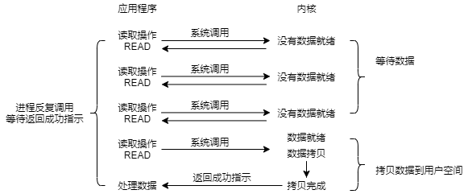
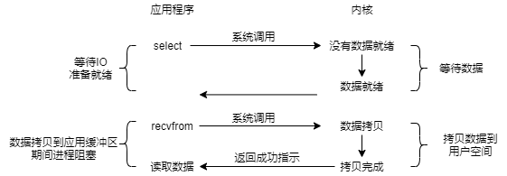
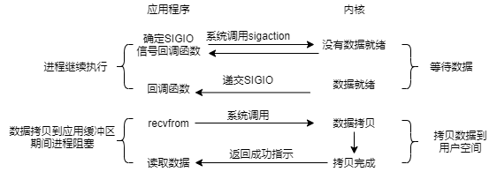
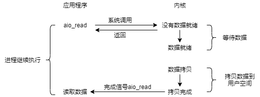

# IO模型

> 注 : 笔记中拓扑图 drawio 源文件在其图片目录下

---

IO 其实就是 Input 和 Output，在操作系统中就对应数据流的输入与输出。这个数据流的两端，可以是文件，也可以是网络的一台主机。但无论是文件，还是网络主机，其传输都是类似的，我们今天就以源头为文件进行说明。

一个文件要从磁盘到我们的内存，需要经过很复杂的操作。首先，需要将数据从硬件读取出来，然后放入操作系统内核缓冲区，之后再将数据拷贝到程序缓冲区，最后应用程序才能读取到这个文件。简单地说，无论什么 IO 模型，其读取过程总会经历下面两个阶段：
* 等待数据到达内核缓冲区
* 从内核缓冲区拷贝数据到程序缓冲区

Linux 根据这两个阶段的是否阻塞，分成了 5 个经典的 IO 的模型
* 阻塞 IO 模型：硬件到系统内核，阻塞。系统内核到程序空间，阻塞。
* 非阻塞 IO 模型：硬件到系统内核，轮询阻塞。系统内核到程序空间，阻塞。
* 复用 IO 模型：硬件到系统内核，多流轮询阻塞。系统内核到程序空间，阻塞。
* 信号驱动 IO 模型：硬件到系统内核，信号回调不阻塞。系统内核到程序空间，阻塞。
* 异步 IO 模型：硬件到系统内核，信号回调不阻塞。系统内核到程序空间，信号回调不阻塞。

---

## 阻塞 IO 模型

阻塞 IO 称为 Blocking IO，简称 BIO。在阻塞 IO 模型中，当进程发起一个读取文件请求（recvfrom 系统调用）时，如果内核缓存区没有对应的数据，那么它不会立刻恢复，而是去读取磁盘数据，当数据读取完毕后，再返回给进程。此时，第一个阶段完成。在这个阶段进程是阻塞的，因为它要等待内核将数据读取到内核缓冲区。

而当进程收到内核的响应之后，进程再把数据从内核缓冲区复制到程序缓冲区，最后完成文件读取操作。此时，第二个阶段完成。在这个阶段进程也是阻塞的，因为它要将数据从内核缓冲区拷贝到程序缓冲区。

在阻塞 IO 模型里，从硬件到系统内核、从系统内核到程序空间，都是阻塞的。

---

## 非阻塞 IO 模型

在非阻塞 IO 模型下，当一个请求发起读取文件请求（recvfrom）时，如果内核缓冲区没有数据，那么内核会读取文件数据。但此时请求并不会阻塞，而是返回一个错误信息（EWOULDBLOCK）告诉进程：数据暂时还没准备好，你待会儿再试试。

于是进程就不断地向内核重试，问：数据准备好了没有，数据准备好了没有……当内核准备好数据，进程就会收到对应消息，于是第一阶段就结束了。非阻塞 IO 中的非阻塞说的就是进程不会阻塞在这里，而是会不断重试。

虽然说这样并没有太大用处，反而会使得 CPU 空转，但总比之前有了一点进步。在这个阶段进程并不是阻塞的。当进程得知内核准备好数据之后，其便会将数据从内核缓冲区拷贝到程序缓冲区。这个阶段与阻塞 I/O 模型是完全一样的，同样是会导致进程阻塞。

在非阻塞 IO 模型里，从硬件到系统内核、从系统内核到程序空间，同样都是阻塞的。但是其比阻塞 IO 争气了一点，并不是站在那里不动，好歹还跑了一下。虽然是在做无用功，但是好歹提高了一丢丢效率。

---

## IO 复用模型

IO 复用之所以叫复用，是因为其能同时操作多个数据流。而前面的 阻塞 IO、非阻塞 IO 同一时间只能操作一个数据流。在 IO 复用模型中，进程监听多个数据流并阻塞，当任何一个数据流有数据之后，其便会收到内核的响应。此时，第一个阶段完成，在这个阶段进程其实是阻塞的。

而当收到内核的响应后，进程便会将数据从内核缓冲区复制到程序缓冲区。这个阶段与上面两个模型一模一样，进程同样阻塞。

IO 复用模型在第二阶段与阻塞 IO 和非阻塞 IO 是完全一致的。但是在第一阶段上，其有效率上的巨大提升，其能同时轮询多个数据流，提高了效率。

---

## 信号驱动 IO 模型

信号驱动与前面几个模型的不同之处就在与信号这个词。信号驱动 IO 在第一阶段，即数据到达内核缓冲区之前，进程是不阻塞的，而是设置一个信号回调。当数据到达内核缓冲区之后，内核调用程序的回调。通过这种方式，信号驱动 IO 下的进程就可以不阻塞，可以去做其他事情了。

而当进程收到信号，进程再将数据从内核缓冲区复制到程序缓冲区。这个过程与上面几个是完全一样的，同样也是阻塞的。

信号驱动 IO 可以说是 IO 读取的一个里程碑，其真正实现了异步读取数据。信号驱动 IO 其二个阶段，与上面几个是一样的。但是其在第一个阶段做到了真正的异步。信号驱动 IO 在第一阶段，其去请求内核读取数据，这时候其不会阻塞，也不会去寻轮，而是设置一个信号回调。 当数据完全拷贝到系统内核时，系统发出 SIGIO 信号，通知进程去进行第二阶段，将数据拷贝到程序缓冲区。

---

## 异步 IO 模型

异步 IO 相比前面几个流程，真正做到了完全非阻塞。无论是在第一阶段，还是在第二阶段都是非阻塞。与信号驱动 IO 类似，异步 IO 模型通过信号回调的方式，在第一个阶段实现了进程的非阻塞。而当数据到达内核缓冲区之后，进程便会收到通知。

而当进程收到通知之后，进程再次将数据从内核缓冲区复制到进程缓冲区，但这时进程并不等待，而是同样设置一个信号回调。当复制完成后，进程收到通知，再进行相应的处理。

异步 IO 与信号驱动 IO 相比，做得更加彻底了！

异步 IO 不仅仅是在第一阶段实现了信号回调，其也在第二阶段实现了信号回调，从而完全实现了异步 IO 操作。

---

## Source & Reference

- https://shuyi.tech/archives/head-first-of-linux-io-model
- https://cloud.tencent.com/developer/article/1684951
