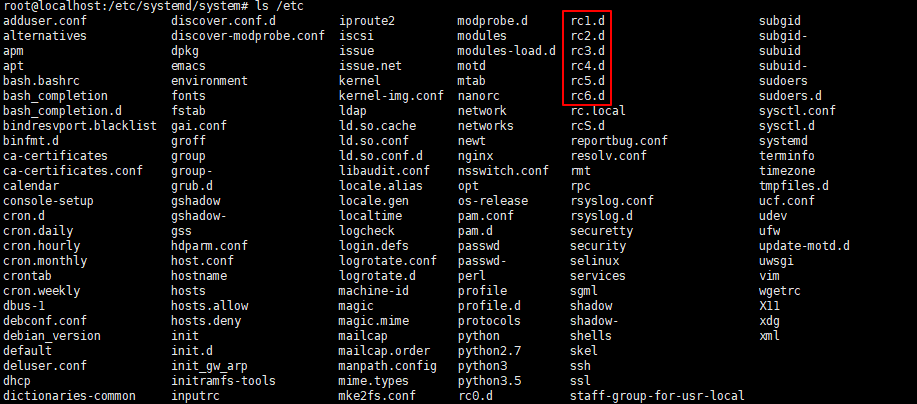
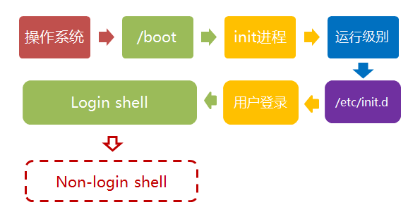

# 启动过程

---

# 开机前
## Wake-on-LAN

OFF 状态表示系统没有上电，没错吧？表面简单，其实不然。例如，如果系统启用了局域网唤醒机制（WOL），以太网指示灯将亮起。通过以下命令来检查是否是这种情况：
```bash
ethtool <interface name>
```

其中 `<interface name>` 是网络接口的名字，比如 eth0。（ethtool 可以在同名的 Linux 软件包中找到。）如果输出中的 Wake-on 显示 g，则远程主机可以通过发送 `魔法数据包` 来启动系统。如果无意远程唤醒系统，也不希望其他人这样做，请在系统 BIOS 菜单中将 WOL 关闭，或者用以下方式：
```bash
ethtool -s <interface name> wol d
```

响应魔法数据包的处理器可能是网络接口的一部分，也可能是底板管理控制器（BMC）。

---

## 英特尔管理引擎、平台控制器单元和 Minix

BMC 不是唯一的在系统关闭时仍在监听的微控制器（MCU）。x86_64 系统还包含了用于远程管理系统的英特尔管理引擎（IME）软件套件。从服务器到笔记本电脑，各种各样的设备都包含了这项技术，它开启了如 KVM 远程控制和英特尔功能许可服务等功能。根据 Intel 自己的检测工具，IME 存在尚未修补的漏洞。坏消息是，要禁用 IME 很难。Trammell Hudson 发起了一个 [me_cleaner](https://github.com/corna/me_cleaner) 项目，它可以清除一些相对恶劣的 IME 组件，比如嵌入式 Web 服务器，但也可能会影响运行它的系统。

---

# 启动
Linux 系统的启动过程可以分为6个阶段

- 引导程序
- 启动内核
- 运行 init
- 系统初始化
- 建立终端
- 用户登录系统

## 引导程序(bootloader)

除了启动那些问题不断的间谍软件外，早期引导固件还有什么功能呢？引导程序的作用是为新上电的处理器提供通用操作系统（如 Linux）所需的资源。在开机时，不但没有虚拟内存，在控制器启动之前连 DRAM 也没有。然后，引导程序打开电源，并扫描总线和接口，以定位内核镜像和根文件系统的位置。U-Boot 和 GRUB 等常见的引导程序支持 USB、PCI 和 NFS 等接口，以及更多的嵌入式专用设备，如 NOR 闪存和 NAND 闪存。引导程序还与 可信平台模块（TPM）等硬件安全设备进行交互，在启动最开始建立信任链。

包括树莓派、任天堂设备、汽车主板和 Chromebook 在内的系统都支持广泛使用的开源引导程序 U-Boot。它没有系统日志，当发生问题时，甚至没有任何控制台输出。为了便于调试，U-Boot 团队提供了一个沙盒，可以在构建主机甚至是夜间的持续集成（CI）系统上测试补丁程序。如果系统上安装了 Git 和 GNU Compiler Collection（GCC）等通用的开发工具，使用 U-Boot 沙盒会相对简单：

在 x86_64 上运行 U-Boot，可以测试一些棘手的功能，如 模拟存储设备 的重新分区、基于 TPM 的密钥操作以及 USB 设备热插拔等。U-Boot 沙盒甚至可以在 GDB 调试器下单步执行。使用沙盒进行开发的速度比将引导程序刷新到电路板上的测试快 10 倍，并且可以使用 `Ctrl + C` 恢复一个“变砖”的沙盒。

## 启动内核

引导程序完成任务后将跳转到已加载到主内存中的内核代码，并开始执行，传递用户指定的任何命令行选项,首先读入 `/boot` 目录下的内核文件。


内核是一个可执行与可链接格式（ELF）的二进制文件(就那个 vmlinuz)，就像 Linux 的用户空间程序一样。


ELF 二进制文件有一个解释器，就像 Bash 和 Python 脚本一样，但是解释器不需要像脚本那样用 #! 指定，因为 ELF 是 Linux 的原生格式。ELF 解释器通过调用 `_start()` 函数来用所需资源配置一个二进制文件，这个函数可以从 glibc 源代码包中找到，可以用 GDB 查看。

在引导时，内核需要硬件信息，不仅仅是已编译过的处理器类型。代码中的指令通过单独存储的配置数据进行扩充。有两种主要的数据存储方法：设备树 和 高级配置和电源接口（ACPI）表。内核通过读取这些文件了解每次启动时需要运行的硬件。

对于嵌入式设备，设备树是已安装硬件的清单。设备树只是一个与内核源代码同时编译的文件，通常与 vmlinux 一样位于 `/boot` 目录中。要查看 ARM 设备上的设备树的内容，只需对名称与 `/boot/*.dtb` 匹配的文件执行 binutils 包中的 strings 命令即可，这里 dtb 是指设备树二进制文件。显然，只需编辑构成它的类 JSON 的文件并重新运行随内核源代码提供的特殊 dtc 编译器即可修改设备树。虽然设备树是一个静态文件，其文件路径通常由命令行引导程序传递给内核，但近年来增加了一个设备树覆盖的功能，内核在启动后可以动态加载热插拔的附加设备。

x86 系列和许多企业级的 ARM64 设备使用 ACPI 机制。与设备树不同的是，ACPI 信息存储在内核在启动时通过访问板载 ROM 而创建的 `/sys/firmware/acpi/tables` 虚拟文件系统中。读取 ACPI 表的简单方法是使用 acpica-tools 包中的 acpidump 命令。

与设备树不同，ACPI 具有方法和数据，而设备树更多地是一种硬件描述语言。ACPI 方法在启动后仍处于活动状态。例如，运行 acpi_listen 命令（在 apcid 包中），然后打开和关闭笔记本机盖会发现 ACPI 功能一直在运行。暂时地和动态地 覆盖 ACPI 表 是可能的，而永久地改变它需要在引导时与 BIOS 菜单交互或刷新 ROM。如果你遇到那么多麻烦，也许你应该 安装 coreboot，这是开源固件的替代品。

---

## 运行 init

内核文件加载以后，就开始运行第一个程序 `/sbin/init`，它的作用是初始化系统环境。

当 init 开始运行时，系统就启动啦！由于第二个处理器现在在运行，机器已经成为我们所熟知和喜爱的异步、可抢占、不可预测和高性能的生物。的确，`ps -o pid,psr,comm -p 1` 很容易显示用户空间的 init 进程已不在引导处理器上运行了。

由于 init 是第一个运行的程序，它的进程编号（pid）就是1。其他所有进程都从它衍生，都是它的子进程,你可以把它比拟成系统所有进程的老祖宗，没有这个进程，系统中任何进程都不会启动。


**init 程序的类型**
- SysV: init, CentOS 5 之前, 配置文件： `/etc/inittab`
- Upstart: init,CentOS 6, 配置文件： `/etc/inittab`, `/etc/init/*.conf`
- Systemd: systemd, CentOS 7,配置文件： `/usr/lib/systemd/system` 、`/etc/systemd/system`

init 程序首先是需要读取配置文件 `/etc/inittab`，它是运行级别的设置文件。如果你打开它，可以看到第一行是这样的：
```
id:2:initdefault:
```

initdefault 的值是 2，表明系统启动时的运行级别为 2。如果需要指定其他级别，可以手动修改这个值。

**运行级别**

许多程序需要开机启动。它们在 Windows 叫做"服务"（service），在 Linux 就叫做"守护进程"（daemon）。

init 进程的一大任务，就是去运行这些开机启动的程序。

但是，不同的场合需要启动不同的程序，比如用作服务器时，需要启动 Apache，用作桌面就不需要。

Linux 允许为不同的场合，分配不同的开机启动程序，这就叫做"运行级别"（runlevel）。也就是说，启动时根据"运行级别"，确定要运行哪些程序。


Linux 系统有 7 个运行级别(runlevel)：
- 运行级别 0 : 系统停机状态，系统默认运行级别不能设为 0，否则不能正常启动
- 运行级别 1 : 单用户工作状态，root 权限，用于系统维护，禁止远程登陆
- 运行级别 2 : 多用户状态(没有 NFS)
- 运行级别 3 : 完全的多用户状态(有 NFS)，登陆后进入控制台命令行模式
- 运行级别 4 : 系统未使用，保留
- 运行级别 5 : X11 控制台，登陆后进入图形 GUI 模式
- 运行级别 6 : 系统正常关闭并重启，默认运行级别不能设为 6，否则不能正常启动

那么，运行级别 2 有些什么程序呢，系统怎么知道每个级别应该加载哪些程序呢？......回答是每个运行级别在 `/etc` 目录下面，都有一个对应的子目录，指定要加载的程序。



看看 `/etc/rc2.d` 目录中到底指定了哪些程序


可以看到，文件名都是"字母 S+两位数字+程序名"的形式。字母 S 表示 Start，也就是启动的意思（启动脚本的运行参数为 start），如果这个位置是字母 K，就代表 Kill（关闭），即如果从其他运行级别切换过来，需要关闭的程序（启动脚本的运行参数为 stop）。后面的两位数字表示处理顺序，数字越小越早处理，所以第一个启动的程序是 motd，然后是 rpcbing、nfs......数字相同时，则按照程序名的字母顺序启动，所以 rsyslog 会先于 sudo 启动。

---

## 系统初始化

七种预设的"运行级别"各自有一个目录，存放需要开机启动的程序。不难想到，如果多个"运行级别"需要启动同一个程序，那么这个程序的启动脚本，就会在每一个目录里都有一个拷贝。这样会造成管理上的困扰：如果要修改启动脚本，岂不是每个目录都要改一遍？

Linux的解决办法，就是七个 `/etc/rcN.d` 目录里列出的程序，都设为链接文件，指向另外一个目录 `/etc/init.d` ，真正的启动脚本都统一放在这个目录中。init 进程逐一加载开机启动程序，其实就是运行这个目录里的启动脚本。


这样做的另一个好处，就是如果你要手动关闭或重启某个进程，直接到目录 `/etc/init.d` 中寻找启动脚本即可。比如，我要重启 Apache 服务器，就运行下面的命令
```bash
/etc/init.d/apache2 restart
```

---

## 建立终端用户登录

rc 执行完毕后，返回 init。这时基本系统环境已经设置好了，各种守护进程也已经启动了。

init 接下来会打开 6 个终端，以便用户登录系统。在 inittab 中的以下 6 行就是定义了 6 个终端：
```
1:2345:respawn:/sbin/mingetty tty1
2:2345:respawn:/sbin/mingetty tty2
3:2345:respawn:/sbin/mingetty tty3
4:2345:respawn:/sbin/mingetty tty4
5:2345:respawn:/sbin/mingetty tty5
6:2345:respawn:/sbin/mingetty tty6
```

从上面可以看出在 2、3、4、5 的运行级别中都将以 respawn 方式运行 mingetty 程序，mingetty 程序能打开终端、设置模式。

同时它会显示一个文本登录界面，这个界面就是我们经常看到的登录界面，在这个登录界面中会提示用户输入用户名，而用户输入的用户将作为参数传给 login 程序来验证用户的身份。


一般来说，用户的登录方式有三种：
- 命令行登录 : init 进程调用 getty 程序（意为get teletype），让用户输入用户名和密码。输入完成后，再调用 login 程序，核对密码（Debian 还会再多运行一个身份核对程序 `/etc/pam.d/login`）。如果密码正确，就从文件 `/etc/passwd` 读取该用户指定的 shell，然后启动这个 shell。
- ssh 登录 : 这时系统调用 sshd 程序（Debian 还会再运行 `/etc/pam.d/ssh`），取代 getty 和 login，然后启动 shell。
- 图形界面登录 : init 进程调用显示管理器，Gnome 图形界面对应的显示管理器为 gdm（GNOME Display Manager），然后用户输入用户名和密码。如果密码正确，就读取 `/etc/gdm3/Xsession`，启动用户的会话。

对于运行级别为 5 的图形方式用户来说，他们的登录是通过一个图形化的登录界面。登录成功后可以直接进入 KDE、Gnome 等窗口管理器。

Linux 的账号验证程序是 login，login 会接收 mingetty 传来的用户名作为用户名参数。

然后 login 会对用户名进行分析：如果用户名不是 root，且存在 `/etc/nologin` 文件，login 将输出 nologin 文件的内容，然后退出。

这通常用来系统维护时防止非 root 用户登录。只有 `/etc/securetty` 中登记了的终端才允许 root 用户登录，如果不存在这个文件，则 root 用户可以在任何终端上登录。

`/etc/usertty` 文件用于对用户作出附加访问限制，如果不存在这个文件，则没有其他限制。

---

## 进入 login shell

所谓 shell，简单说就是命令行界面，让用户可以直接与操作系统对话。用户登录时打开的 shell，就叫做 login shell。


Debian 默认的 shell 是 Bash，它会读入一系列的配置文件。上一步的三种情况，在这一步的处理，也存在差异。

- 命令行登录：首先读入 `/etc/profile`，这是对所有用户都有效的配置；然后依次寻找下面三个文件，这是针对当前用户的配置。
    ```bash
    ~/.bash_profile
    ~/.bash_login
    ~/.profile
    ```
    需要注意的是，这三个文件只要有一个存在，就不再读入后面的文件了。比如，要是 `~/.bash_profile` 存在，就不会再读入后面两个文件了。

- ssh 登录：与第一种情况完全相同。
- 图形界面登录：只加载 `/etc/profile` 和 `~/.profile`。也就是说，`~/.bash_profile` 不管有没有，都不会运行。

**non-login shell**

用户进入操作系统以后，常常会再手动开启一个 shell。这个 shell 就叫做 non-login shell，意思是它不同于登录时出现的那个 shell，不读取 /etc/profile 和 .profile 等配置文件。



non-login shell 的重要性，不仅在于它是用户最常接触的那个 shell，还在于它会读入用户自己的 bash 配置文件 `~/.bashrc`。大多数时候，我们对于 bash 的定制，都是写在这个文件里面的。

你也许会问，要是不进入 non-login shell，岂不是 `.bashrc` 就不会运行了，因此 bash 也就不能完成定制了？事实上，Debian 已经考虑到这个问题了，请打开文件 `~/.profile`，可以看到下面的代码：
```sh
if [ "$BASH" ]; then
  if [ -f ~/.bashrc ]; then
    . ~/.bashrc
  fi
fi
```

上面代码先判断变量 $BASH 是否有值，然后判断主目录下是否存在 `.bashrc` 文件，如果存在就运行该文件。第三行开头的那个点，是 source 命令的简写形式，表示运行某个文件，写成 "source ~/.bashrc" 也是可以的。

因此，只要运行 `～/.profile` 文件，`～/.bashrc` 文件就会连带运行。但是之前提到过，如果存在 `～/.bash_profile`文件，那么有可能不会运行 `～/.profile` 文件。解决这个问题很简单，把下面代码写入 `.bash_profile` 就行了。

```sh
if [ -f ~/.profile ]; then
　　. ~/.profile
fi
```

Bash 的设置之所以如此繁琐，是由于历史原因造成的。早期的时候，计算机运行速度很慢，载入配置文件需要很长时间，Bash 的作者只好把配置文件分成了几个部分，阶段性载入。系统的通用设置放在 `/etc/profile`，用户个人的、需要被所有子进程继承的设置放在 `.profile`，不需要被继承的设置放在 `.bashrc`。

**图形模式与文字模式的切换方式**

Linux 预设提供了六个命令窗口终端机让我们来登录。

默认我们登录的就是第一个窗口，也就是 tty1，这个六个窗口分别为 tty1,tty2 … tty6，你可以按下 `Ctrl + Alt + F1 ~ F6` 来切换它们。

如果你安装了图形界面，默认情况下是进入图形界面的，此时你就可以按 `Ctrl + Alt + F1 ~ F6` 来进入其中一个命令窗口界面。

当你进入命令窗口界面后再返回图形界面只要按下 `Ctrl + Alt + F7` 就回来了。

如果你用的 vmware 虚拟机，命令窗口切换的快捷键为 `Alt + Space + F1~F6`. 如果你在图形界面下请按 `Alt + Shift + Ctrl + F1~F6` 切换至命令窗口。

---

## Linux 关机

在 linux 领域内大多用在服务器上，很少遇到关机的操作。毕竟服务器上跑一个服务是永无止境的，除非特殊情况下，不得已才会关机。

正确的关机流程为：`sync > shutdown > reboot > halt`

关机指令为：`shutdown` ，你可以 `man shutdown` 来看一下帮助文档。

例如你可以运行如下命令关机：
```bash
sync                # 将数据由内存同步到硬盘中。
shutdown            # 关机指令
shutdown -h 10 'This server will shutdown after 10 mins'    # 这个命令告诉大家，计算机将在10分钟后关机，并且会显示在当前登陆用户的屏幕中。
shutdown -h now     # 立马关机
shutdown -h 20:25   # 系统会在今天20:25关机
shutdown -h +10     # 十分钟后关机
shutdown -r now     # 系统立马重启
shutdown -r +10     # 系统十分钟后重启
reboot              # 就是重启，等同于 shutdown -r now
halt                # 关闭系统，等同于 shutdown -h now 和 poweroff
```

最后总结一下，不管是重启系统还是关闭系统，首先要运行 `sync` 命令，把内存中的数据写到磁盘中。

关机的命令有 `shutdown -h now halt poweroff` 和 `init 0` , 重启系统的命令有 `shutdown -r now reboot init 6`

---

**Source & Reference**
- [Linux 系统启动过程](https://www.runoob.com/linux/linux-system-boot.html)
- [Linux 启动过程分析](https://linux.cn/article-9437-1.html)
- [Linux 的启动流程](http://www.ruanyifeng.com/blog/2013/08/linux_boot_process.html)
