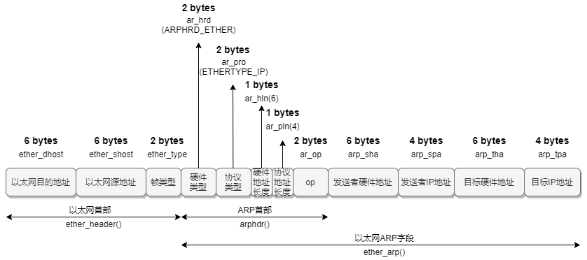

# TCP/IP

> 分类参考科来网络通讯协议图

> 注 : 笔记中拓扑图 drawio 源文件在其图片目录下

---

## 应用层

### DNS

- [DNS 笔记](./应用层/DNS.md)

### RTSP

### MQTT

### LDAP

### DHCP

---

## 会话层

### SSL

### TLS

---

## 传输层

### TCP

TCP 是面向连接的

### UDP

UDP 是无连接的

---

## 网络层

### ipv4

**基础**

IPv4 地址是类似 `A.B.C.D` 的格式,它是 32 位,用 `.` 分成四段,用 10 进制表示;而 IPv6 地址类似 `X:X:X:X:X:X:X:X` 的格式,它是 128 位的,用 `:` 分成 8 段,用 16 进制表示;

### ipv6

> 本部分大部分内容由 [Survivor_ms](https://github.com/136510385) 提供,在此只做排版修改

**文章**
- [闲谈IPv6系列文章集锦](https://blog.csdn.net/dog250/article/details/88651885)

**表示法**
- **地址写法**
    - 1080:0:0:0:8:800:200C:417A 可简写为 1080::8:800:200C:417A
    - FF01:0:0:0:0:0:0:101 可简写为 FF01::101
    - 0:0:0:0:0:0:0:1 可简写为 ::1
    - 0:0:0:0:0:0:0:0 可简写为 ::

- **地址分类**
    - IPv6 地址指定给接口,一个接口可以指定多个地址.
    - IPv6 地址有作用域:
        - link local 地址 本链路有效
        - site local 地址 本区域(站点)内有效,一个 site 通常是个校园网
        - global地址 全球有效,即可汇聚全球单播地址
    - IPv6 地址分类:
        - unicast 单播(单点传送)地址
        - multicast 组播(多点传送)地址
        - anycast 任播(任意点传送)地址

    IPv6 没有定义广播地址,其功能由组播地址替代

- **常用地址及前缀**
    - ::/128   即 0:0:0:0:0:0:0:0,只能作为尚未获得正式地址的主机的源地址,不能作为目的地址,不能分配给真实的网络接口.
    - ::1/128 即 0:0:0:0:0:0:0:1,回环地址,相当于 IPv4 中的 localhost(127.0.0.1),ping locahost 可得到此地址.
    - 2001::/16  全球可聚合地址,由 IANA 按地域和 ISP 进行分配,是最常用的 IPv6 地址,属于单播地址.
    - 2002::/16  6 to 4 地址,用于 6to4 自动构造隧道技术的地址,属于单播地址.
    - 3ffe::/16   早期开始的 IPv6 6bone 试验网 地址,属于单播地址.
    - fe80::/10   本地链路地址,用于单一链路,适用于自动配置、邻机发现等,路由器不转发以fe80开头的地址.
    - ff00::/8  组播地址.
    - ::A.B.C.D  兼容 IPv4 的 IPv6 地址,其中 <A.B.C.D> 代表 IPv4 地址.自动将 IPv6 包以隧道方式在 IPv4 网络中传送的 IPv4/IPv6 节点将使用这些地址.
    - ::FFFF:A.B.C.D 是 IPv4 映射过来的 IPv6 地址,其中 <A.B.C.D> 代表 IPv4 地址,例如 ::ffff:202.120.2.30 ,它是在不支持 IPv6 的网上用于表示 IPv4 节点.

**ipv4 与 ipv6 对比**

| IPv4地址                                                         | IPv6地址                                       |
| ---------------------------------------------------------------- | ---------------------------------------------- |
| 组播地址(224.0.0.0/4)                                         | IPv6 组播地址(FF00::/8)                       |
| 广播地址                                                         | 无,只有任播(anycast)地址                   |
| 未指定地址为 0\.0\.0\.0                                          | 未指定地址为 ::                                |
| 回路地址为 127\.0\.0\.1                                          | 回路地址为 ::1                                 |
| 公用 IP地址                                                      | 可汇聚全球单播地址                             |
| 私有地址(10\.0\.0 \.0/8、172\.16\.0\.0/12 和 192\.168\.0\.0/16) | 本地站点地址(FEC0::/48)                     |
| Microsoft 自动专用 IP 寻址自动配置的地址(169\.254\.0\.0/16)       | 本地链路地址(FE80::/64)                     |
| 表达方式:点分十进制                                             | 表达方式:冒号十六进制式(取消前置零、零压缩) |
| 子网掩码表示:以点阵十进制表示法或前缀长度表示法(CIDR)        | 子网掩码表示:仅使用前缀长度表示法(CIDR)    |

**使用**
1. 双栈策略
2. 隧道策略

### ICMP

`互联网控制信息协议`

ICMP 协议是 Internet 控制报文协议。它属于网络层协议，是 TCP/IP 协议簇的一个子协议，用于在 IP 主机、路由器之间传递控制消息。控制消息是指网络通不通、主机是否可达、路由是否可用等网络本身的消息。这些控制消息虽然并不传输用户数据，但是对于用户数据的传递起着重要的作用。

**文章**
- [内网穿透-ICMP协议](https://mp.weixin.qq.com/s/ZA6NlOg5SXggBLgk7ClUfA)

**ICMP报文格式**

抓包过程见 [Wireshark笔记](../../Security/BlueTeam/实验/流量分析.md#icmp) 案例中 icmp 部分

---

## 数据链路层

### ARP

### RARP

### CDP

### PPTP

### L2TP

### MSTP

### RSTP

### STP

### VTP

### VLAN

### VRRP

---

## 物理层

