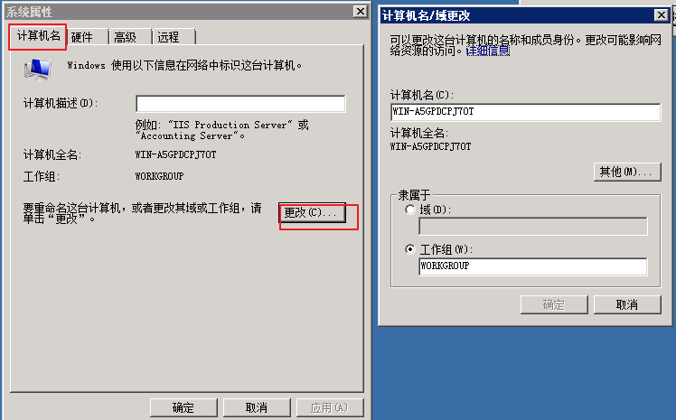

# 工作组

---

**工作组的定义**

工作组是局域网中的一个概念，它是最常见的资源管理模式，简单是因为默认情况下计算机都是采用工作组方式进行资源管理的。将不同的电脑按功能分别列入不同的组中，以方便管理。默认情况下所有计算机都处在名为 WORKGROUP 的工作组中，工作组资源管理模式适合于网络中计算机不多，对管理要求不严格的情况。它的建立步骤简单，使用起来也很好上手。大部分中小公司都采取工作组的方式对资源进行权限分配和目录共享。相同组中的不同用户通过对方主机的用户名和密码可以查看对方共享的文件夹，默认共享的是 Users 目录。不同组的不同用户通过对方主机的用户名和密码也可以查看对方共享的文件夹。所以工作组并不存在真正的集中管理作用,工作组里的所有计算机都是对等的,也就是没有服务器和客户机之分的。

**工作组的加入**

右击桌面上的“计算机”，在弹出的菜单出选择“属性”，点击“高级系统设置”-->“计算机名”，点击“更改”在“计算机名”一栏中键入你想好的名称，在“工作组”一栏中键入你想加入的工作组名称。如果你输入的工作组名称网络中没有，那么相当于新建了一个工作组，当然暂时只有你的电脑在组内。单击“确定”按钮后，Windows 提示需要重新启动，重新启动之后，再进入“网络”就可以看到你所加入的工作组成员了

**工作组的退出**

只要将工作组名称改动即可。不过在网上别人照样可以访问你的共享资源。你也可以随便加入同一网络上的任何其它工作组。“工作组”就像一个可以自由进入和退出的“社团”，方便同一组的计算机互相访问。

**工作组的访问**

文件夹-->网络，就可以查看到我们工作组中的其他计算机了，当你要访问某台计算机时，点击它，然后输入该主机的用户名和密码即可看到该主机共享的文件夹。

**工作组的优缺点**

- 优点

    在一个网络内，可能有上百台电脑，如果这些电脑不进行分组，都列在“网上邻居”中，电脑无规则的排列为我们访问资源带来不方便。为了解决这一问题，Windows98操作系统之后就引用了“工作组”这个概念，将不同的电脑按功能分别列入不同的组中，如软件部的电脑都列入“软件部”工作组中，网络部的电脑都列入“网络部”工作组中。你要访问某个部门的资源，就在“网上邻居”里找到那个部门的工作组名，双击就可以看到那个部门的电脑了。计算机通过工作组进行分类，使得我们访问资源更加具有层次化。工作组情况下资源可以相当随机和灵活的分布，更方便资源共享，管理员只需要实施相当低级的维护。

- 缺点

    缺乏集中管理与控制的机制，没有集中的统一帐户管理，没有对资源实施更加高效率的集中管理，没有实施工作站的有效配置和安全性严密控制。只适合小规模用户的使用。

基于以上缺点，当计算机数量比较多，大型企业中网络规模大，需要统一的管理和集中的身份验证，并且能够给用户提供方便的搜索和使用网络资源的方式，工作组的组织形式就不合适了，于是域就出现了

**Source & Reference**
- [内网渗透 | 工作组和域的区别](https://mp.weixin.qq.com/s/5wgCGHrE5MNsKvN9rChBsw)
