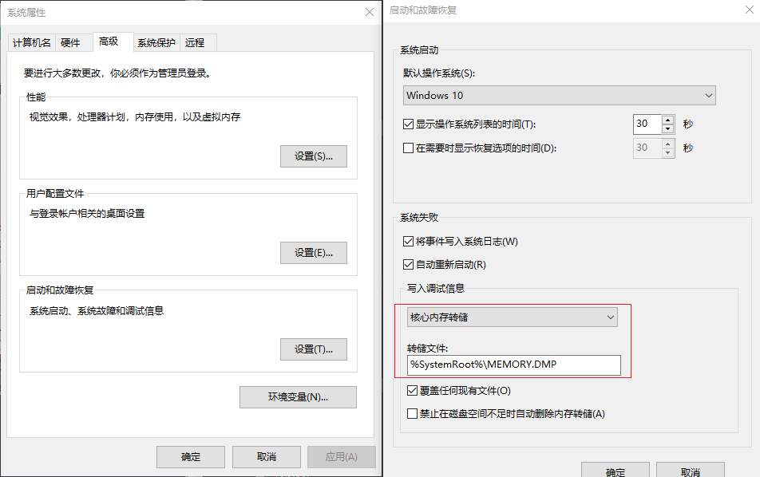

# 内存取证

> 注 : 笔记中拓扑图 xmind 源文件在其图片目录下

---

## 免责声明

`本文档仅供学习和研究使用,请勿使用文中的技术源码用于非法用途,任何人造成的任何负面影响,与本人无关.`

---

**简介**

内存取证一般指对计算机及相关智能设备运行时的物理内存中存储的临时数据进行获取与分析，提取重要信息。

**相关文章**
- [计算机内存取证技术](http://www.binarydata.cn/archives/772.html)
- [数字取证-死活取证](https://blog.taielab.com/2019-05-09/digital-forensics-live-and-dead.html)
- [Linux Forensics Series Chapter 1 — Memory Forensics](https://medium.com/@ozan.unal/linux-forensics-series-chapter-1-memory-forensics-372b9dba49d7)
- [使用工具进行计算机取证](https://www.cnblogs.com/xd502djj/p/11245968.html)
- [内存取证研究与进展](http://www.jos.org.cn/html/2015/5/4821.htm)

**CTF writup**
- [V&N2020 公开赛Misc-内存取证 Writeup](https://zhuanlan.zhihu.com/p/110104787)
- [【CTF】利用volatility与Gimp实现Windows内存取证](https://segmentfault.com/a/1190000018813033)
- [内存取证三项CTF赛题详解](https://www.freebuf.com/news/145262.html)
- [高校战“疫”网络安全分享赛--ez_mem&dump wp](https://segmentfault.com/a/1190000021955023)

---

# 内存提取

<p align="center">
    
</p>

这个步骤是从目标机器中导出内存。完整的内存数据包括两部分: 物理内存数据和页面交换文件数据. 物理内存通常是一个特殊的内核对象, 比如, 在 Windows 系统中, 物理内存是内核内存区对象, 即 `\\Device\\PhysicalMemory`; 在 Unix/Linux 系统中, 物理内存为 `/dev/mem` 和 `/dev/kmem`. 只要能读取该内核对象, 就能获取物理内存数据.

你可以在物理机上使用工具比如 Win32dd/Win64dd, Memoryze, DumpIt, FastDump 。然而在虚拟机上，获取内存是很容易的，你可以暂停 VM 并取出 `.vmem` 文件。

**相关文章**
- [内存镜像获取工具推荐](http://blog.md5.red/?p=578)
- [NOTES ON LINUX MEMORY ANALYSIS - LIME, VOLATILITY AND LKM’S](https://countuponsecurity.com/2019/10/14/notes-on-linux-memory-analysis-lime-volatility-and-lkms/)
- [如何生成转储(dmp)文件--工具篇](https://blog.csdn.net/daye5465/article/details/77718111)
- [VMware虚拟机蓝屏开不了机如何取dump文件](https://blog.csdn.net/hzf202/article/details/83107091)
- [Extracting passwords from hiberfil.sys and memory dumps](https://diverto.github.io/2019/11/05/Extracting-Passwords-from-hiberfil-and-memdumps)
- [渗透测试中的冷却启动攻击和其他取证技术](https://www.freebuf.com/articles/system/23409.html)
- [Linux 服务器取证](https://mp.weixin.qq.com/s/1DA03hjJmd1Lm24f0nXG0Q)

## 基于硬件的内存获取

根据所面向的硬件体系和操作系统的不同,可以分为以下几种

**面向 Intel 架构桌面操作系统的内存获取**

此类基于硬件的内存获取方法主要通过插入硬件卡, 利用 DMA(direct memory access, 直接内存访问) 指令去获取物理内存的拷贝. 在拷贝物理内存时, 目标系统的 CPU 将暂停, 以避免因操作系统的执行而改变内存数据. 目前有以下几种类型的硬件卡:

- 基于 PCI 卡拷贝物理内存 (hardware card based technique)
- 基于 IEEE 1394 火线接口拷贝物理内存 (hardware bus based technique)
- 基于固件的物理内存拷贝 (firmware based technique), 利用 PCI 网卡中的 SMM(system management mode, 系统管理模式) 固件获取物理内存和 CPU 寄存器内容;
- 基于网卡拷贝物理内存 (network card based technique), 比如, 利用网卡的 NDIS(network driver interface specification, 网络驱动程序接口规范) 来获取物理内存;
- 基于雷电接口 Thunderbolt 拷贝物理内存 (Thunderbolt based technique)

此类方法的优点是:
- 在基于 Intel 架构的操作系统 (Windows,Linux,Mac OS 等) 中, 都可以利用该方法获取物理内存;
- 采用 DMA 方式能够在不干扰操作系统和 CPU 的情况下, 较为准确地获取物理内存拷贝.

其缺点是:
- 如攻击者对主板上的北桥芯片进行重新编程, 则很容易欺骗此类方法;
- 早期的 PCI 硬件卡须事先插入主板中, 这对于遭受实时攻击的系统来说是不现实的;
- 新版 BIOS 对 SMM 模式进行锁定, 限制了利用固件获取物理内存的应用;
- 如果攻击者对 NDIS 库进行劫持, 就能篡改通过网卡传送的物理内存数据;
- 只能获取物理内存 RAM, 不能获取页面交换文件.

**面向 ARM 结构智能终端操作系统的内存获取**

面向智能终端的硬件获取方法主要通过硬件与终端设备相连接, 以获取智能终端设备的内存数据. 目前, 基于硬件的内存获取方法主要有两种:
- JTAG(joint test action group, 联合测试行动小组)技术;
    - JTAG 技术是通过在印刷电路板上与特定的 JTAG 接头相连以连接智能终端设备中的 CPU, 在向电路供电后, 再借助 JTAG 软件转储整个内存数据. 该方法的优点是无需获得智能终端设备的 Root 访问权限即可实现内存数据获取, 但其缺点是, 如果 JTAG 焊接点出错或供电电压错误, 则将导致 JTAG 无法使用, 且对智能终端设备造成严重损坏.

- 芯片摘取 (chip-off) 技术.
    - 芯片摘取 (chip-off) 技术是将内存芯片从智能终端设备中取出, 再通过特殊的硬件设备读取其中存储的数据. 该方法的优点是可绕过智能终端设备的口令保护, 还能修复已遭毁坏的智能终端设备中的数据; 但其缺点是把内存芯片取出和重新装入印刷电路板, 将可能损坏内存芯片.

---

## 基于软件的内存获取

### Windows

**相关工具**
- [moonsols](https://www.moonsols.com/) - moonsols 可以处理休眠文件（Hiberfil.sys），crashdump 文件和 raw memory dump 文件，crashdump 可以被 winDBG 加载进行分析，所以最终要转化为 crashdump 文件。
    - Dumpit - 一款 windows 内存镜像取证工具。利用它我们可以轻松地将一个系统的完整内存镜像下来，并用于后续的调查取证工作
- [Belkasoft RAMCapturer](https://belkasoft.com/ram-capturer)
- [Magnet RAM Capture](https://www.magnetforensics.com/resources/magnet-ram-capture/)
- [Winpmem](https://github.com/Velocidex/WinPmem)
- [FTK Imager](https://accessdata.com/product-download)
- [Redline](https://www.fireeye.com/services/freeware/redline.html)
- Elcomsoft System Recovery
- AvDump - 提取指定 pid 的内存
    ```
    .\avdump64.exe --pid <pid> --exception_ptr 0 --thread_id 0 --dump_level 1 --dump_file lsass.dmp
    ```
- procdump

#### hiberfil.sys

休眠 (hibernate) 是指系统将内存中的数据全部转储到硬盘上一个休眠文件中, 然后切断对所有设备的供电, 并在下次开机时, 系统会将硬盘上的休眠文件内容直接读入内存, 并恢复到休眠之前的状态. 由于休眠文件中保存的是休眠时刻系统的内存记录, 因此, 系统休眠文件也成了获取内存数据的一种方式.

在 Windows 系统中, 当系统进入节能休眠模式时, 会自动生成休眠文件 Hiberfil.sys 且存放在 Windows 系统根目录下.

在 Linux 系统中, 休眠文件保存在 swap 分区中. 在 Mac OS 系统中, 休眠文件保存在 `/var/vm/sleepimage` 中. 基于系统休眠文件的内存获取方法, 就是利用操作系统这种机制来获取内存数据.

该方法尽管实现简单, 但存在如下缺陷:
- 由于系统休眠时保存的物理内存 RAM 中的数据, 未包括页面交换文件数据, 导致无法获取全部内存数据;
- 需要与物理内存 RAM 大小相同的硬盘空间, 以存储休眠文件;
- 不同操作系统的休眠文件格式未知, 且压缩存放, 这给取证分析该文件带来了困难;
- 该方法除了需要 BIOS 支持以外, 还需要外围硬件设备能够支持节电状态, 且这些设备驱动必须能够接收电源管理指令.

如果计算机在挂载加密分区时进入休眠状态，则 OTFE 密钥可以直接存储在系统的休眠文件中。

在某些情况下，存在 hiberfil.sys，但尚未使用。最好检查 hiberfil.sys 是否为空（全零字节）
```bash
cat hiberfil.sys | tr -d '\0' | read -n 1 || echo "All null bytes"
```

将 hiberfil.sys 转换为 dmp 格式

- volatility
    ```bash
    volatility_standalone.exe -f d:\hiberfilsys.copy imageinfo
    volatility_standalone.exe -f d:\hiberfilsys.copy --profile=Win7SP1x64 hibinfo
    volatility_standalone.exe -f d:\hiberfilsys.copy imagecopy --profile=Win7SP1x64 -O hiber.raw
    volatility_standalone.exe -f hiberfil.raw --profile=Win7SP1x64 raw2dmp -O hiberfil.dmp
    ```

- Hibr2Dmp
    ```bash
    Hibr2Dmp.exe hiberfil.sys hiberfil.dmp
    ```

#### MEMORY.DMP

MEMORY.DMP 文件是 Windows 操作系统中的内存转储文件，当 Windows 发生错误蓝屏的时候，系统将当前内存（含虚拟内存）中的数据直接写到文件中去，方便定位故障原因。



---

### MAX OSX

**相关工具**
- [osxpmem](https://github.com/google/rekall/)
    ```bash
    sudo chown -R root:wheel pmem.kext
    sudo chown chmod -R 755 pmem.kext
    sudo kextload -v pmem.kext
    ./osxpmem -f raw mem.bin
    ```
- MacMemoryReader
- Recon for Mac OSX
- Blackbag MacQuisition

---

### Linux

**相关工具**
- [504ensicsLabs/LiME](https://github.com/504ensicslabs/lime) - LiME 是一个用于获取各种取证数据的命令行工具。
    ```bash
    # 编译 LiME
    yum install -y gcc make gcc-c++
    yum install -y kernel-devel
    ls -lisa /usr/src/kernels/
    git clone https://github.com/504ensicslabs/lime
    cd lime/src
    make    # 如果编译失败有可能是 /lib/modules/xxx/ 的 build 链接错误,重新连接即可

    # 在这个过程的最后，它被编译成一个可下载的 Linux 版本的内核对象。使用 insmod 命令运行 LiME。此步骤将获取 LiME 格式的内存样本,现在我们已经准备好接收内存镜像了。我想在 usb 上打印，所以我给出了 usb 内存的路径。我必须在这里提醒你一些事情。存储器图像的尺寸并不小，所以要确保在你要拍摄图像的设备中有足够的空间,最后，你可以使用 rmmod 删除模块。
    insmod ./lime-3.10.0-1062.18.1.el7.x86_64.ko path=/media/usbaaa/ESD-USB/linux64.mem format=raw
    rmmod lime
    ```
- [halpomeranz/lmg](https://github.com/halpomeranz/lmg) - 配合 LiME 获取镜像，简化操作
    ```
    将 lmg-master 内文件放入 LiME 的 src 文件夹，运行 ./lmg 搞定。
    ```
- linpmem
- [Draugr](https://code.google.com/archive/p/draugr/)
- [Volatilitux](https://code.google.com/archive/p/volatilitux/)
- [Memfetch](https://lcamtuf.coredump.cx/)
- Memdump
- [fmem](https://github.com/NateBrune/fmem)
    ```bash
    git clone https://github.com/NateBrune/fmem
    cd fmem

        # ubuntu install dwarfdump
        apt-get install -y dwarfdump

        # centos install dwarfdump
        yum install -y gcc make gcc-c++
        yum install -y elfutils-devel
        yum install -y kernel-devel
        wget https://www.prevanders.net/libdwarf-20201201.tar.gz
        tar -zxvf libdwarf-20201201.tar.gz
        cd libdwarf-20201201
        ./configure
        make
        make install
        cd ../

    make    # 如果编译失败有可能是 /lib/modules/xxx/ 的 build 链接错误,重新连接即可
    ./run.sh
    dd if=/dev/fmem of=/root/cyq.vmem bs=1MB count=2048    # 将内存里的数据拷贝到 root 目录下的 cyq.vmem 文件
    ```

---

### Vmware

VMWare 虚拟机在暂停或挂起时, 内存状态信息会保存在以. Vmss 为扩展名的文件中; 在建立系统快照时, 包括内存在内的系统状态信息会保存在以. Vmsn 为扩展名的文件中; 而虚拟客户机的所有内存信息会保存在以. Vmem 为扩展名的文件中

**相关工具**
- [vmss2core](https://flings.vmware.com/vmss2core) - 快照文件转换为内存转储,开发人员可以使用此工具将虚拟机检查点转换为核心转储文件，从而对客户机操作系统和应用程序进行调试。检查点可以是快照或挂起文件。
    ```bash
    # vmss 是挂起,vmsn 是快照,vmem 是虚拟机内存转储

    vmss2core.exe -W virtual_machine_name.vmss virtual_machine_name.vmem
        # 注意："2195" for Win32, "6000" for Win64
        vmss2core.exe -W2195 virtual_machine_name.vmss virtual_machine_name.vmem
        vmss2core.exe -W6000 virtual_machine_name.vmss virtual_machine_name.vmem
        # 注意：如果你使用的是 Microsoft Windows 8/8.1、Windows Server 2012、Windows Server 2016 或 Windows Server 2019
        vmss2core.exe -W8 virtual_machine_name.vmss virtual_machine_name.vmem

    # 注意：如果使用的是 Linux，请运行如下命令：
    ./vmss2core-Linux64 -N virtual_machine_name.vmss

    # 要在虚拟机位于 ESX/ESXi 主机上时创建内存转储
    # 启动与主机的 SSH 会话。
    vm-support -x               # 确定虚拟机的域 ID
        # 注意：对于 ESXi 6.7，请使用命令 esxcli vm process list
    vm-support -Z [world_ID]    # 挂起虚拟机
    # 将 virtual_machine_name.vmss 文件复制到你的 vmss2core 工具所在的位置
    vmss2core -W virtual_machine_name.vmss  # 运行 vmss2core 工具
    ```

- Bin2Dmp
    ```bash
    # 据说可以从 vmem 转为 dmp,但我测试时未成功
    Bin2Dmp.exe vmware.vmem vmware.dmp
    ```

- Volatility
    ```bash
    # 需要指定 profile
    volatility_standalone.exe -f vmware.vmem --profile=Win7SP1x64 raw2dmp -O vmware.dmp
    ```

---

### VirtualBox

**相关工具**
- vboxmanage + [vboxelf2raw.sh](https://gist.github.com/kost/606145346d47c5ed0469d4e9ac415927) + Volatility
    ```bash
    vboxmanage debugvm "win7test" dumpvmcore --filename testvbox.elf
    # VirtualBox 内存转储采用 ELF 格式，其中 load1 段保存原始内存转储。
    ./vboxelf2raw.sh testvbox.elf
    volatility_standalone.exe -f testvbox.elf.raw --profile=Win7SP1x64 raw2dmp -O testvbox.dmp
    ```

---

# 内存分析

**内存取证工具**
- [Volatility](../../安全工具/Volatility.md) - Volatility Framwork 是一款开源的基于 Python 开发的内存分析框架，它自带的分析插件支持分析内存镜像中所保留的历史网络连接信息、历史进程、历史命令记录等等。
- [Elcomsoft Forensic Disk Decryptor](https://cn.elcomsoft.com/efdd.html) - 即时访问保存在加密的 BitLocker，FileVault 2，PGP，TrueCrypt 和 VeraCrypt 存储中的数据。该工具从 RAM 捕获数据，休眠和页面文件中提取加密密钥，或使用纯文本密码或托管密钥来解密存储在加密容器中的文件和文件夹，或者将加密卷装载为新的驱动器号，以便进行实时访问。
- [gleeda/memtriage](https://github.com/gleeda/memtriage) - 集成了 Winpmem 和 Volatility 的工具
- WinHex
- 取证大师
- [makomk/aeskeyfind](https://github.com/makomk/aeskeyfind) - 该工具用于在内存转储中寻找 AES 密钥
