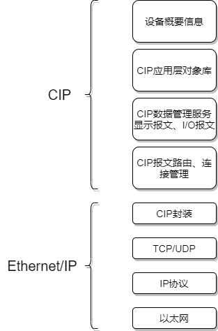
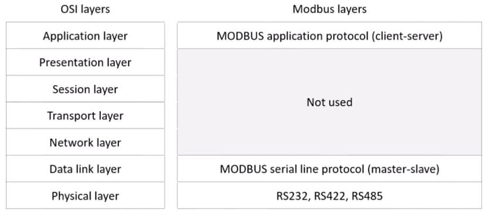
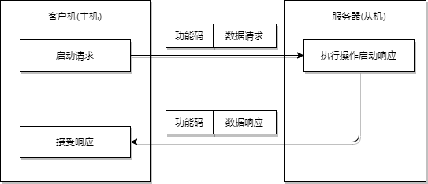
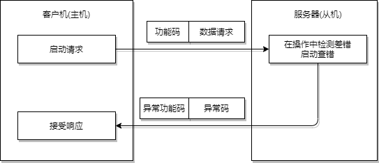
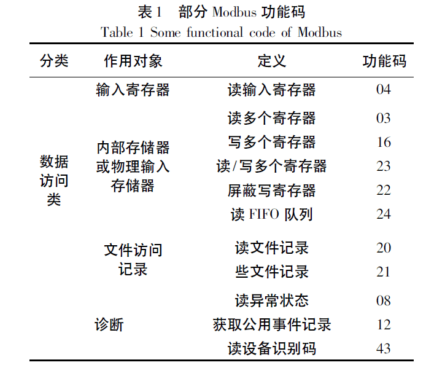
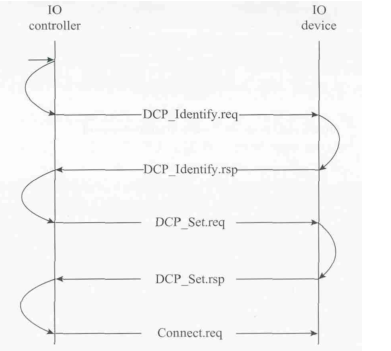

# 工控协议

    

---

## 免责声明

`本人撰写的手册,仅供学习和研究使用,请勿使用文中的技术源码用于非法用途,任何人造成的任何负面影响,与本人无关.`

---

# 大纲

* [S7Comm](#s7comm)
    * [S7Comm-Header](#s7comm-header)
    * [Job和Ack_Data](#job和ack_data)
    * [Userdata协议拓展](#userdata协议拓展)
* [S7comm-plus](#s7comm-plus)
* [TPKT](#tpkt)
* [COTP](#cotp)
* [Ethernet/IP](#ethernet/ip)
* [Modbus](#modbus)
    * [Modbus功能码](#modbus功能码)
* [Profinet](#profinet)
* [PROFIBUS](#profibus)
* [DNP3](#dnp3)
* [ICCP](#iccp)
* [OPC](#opc)
* [Niagara-Fox](#niagara-fox)
* [BACnet](#bacnet)
* [GE-SRTP](#ge-srtp)
* [HART-IP](#hart-ip)
* [PCWorx](#pcworx)
* [MELSEC-Q](#melsec-q)
* [OMRON-FINS](#omron-fins)
* [Crimson-v3](#crimson-v3)
* [Codesys](#codesys)
* [ProConOS](#proconos)
* [moxa-nport](#moxa-nport)

---

# S7Comm

S7Comm（S7 Communication）是西门子专有的协议，是西门子 S7 通讯协议簇里的一种。

**相关文章**
- [工控安全 | 西门子通信协议S7COMM（Part 1）](https://www.freebuf.com/articles/ics-articles/188159.html)
- [工控安全 | 西门子通信协议S7COMM（Part 2）](https://www.freebuf.com/articles/ics-articles/188606.html)
- [S7comm - The Wireshark Wiki](https://wiki.wireshark.org/S7comm)
- [西门子通信协议S7Comm](https://web.archive.org/web/20190925060928/https://laucyun.com/3aa43ada8cfbd7eca51304b0c305b523.html)

**相关资源**
- [(完整版)西门子S7协议解析](https://wenku.baidu.com/view/c29ee884366baf1ffc4ffe4733687e21ae45ff5f.html#)

**S7comm 协议**
- [S7comm 相关](./S7comm相关.md)

**抓包分析**
- 见 [Wireshark笔记](../BlueTeam/实验/流量分析.md#s7comm) 案例中 s7comm 部分

**仿真搭建**
- [siemens](./PLC攻击.md#siemens)

---

# S7comm-plus

**相关文章**
- [西门子S7comm-plus通信过程及重放攻击分析](https://www.freebuf.com/articles/ics-articles/220239.html)

---

# TPKT

TPKT 协议是应用层数据传输协议，介于 TCP 和 COTP 协议之间。这是一个传输服务协议，主要用来在 COTP 和 TCP 之间建立桥梁。

随着 TCP 越来越流行（大约在1995年左右），需要一种在 TCP 传输之上封装 ISO 服务的机制，因为这两个协议都具有相似的任务，而 COTP 如今已经过时了。

TPKT 使用 TCP 作为其传输协议。 TPKT 通信的 TCP 端口是 102。

TPKT 是一种 "封装 "协议。它在自己的数据包的数据 Payload 中携带 OSI 数据包，然后将产生的结构传递给 TCP，至此，数据包被当作 TCP/IP 数据包处理。传递数据给 TPKT 的 OSI 程序并不知道自己的数据将通过 TCP/IP 进行传输，因为 TPKT 模拟了 OSI 协议传输服务接入点(TSAP)。

其中，TPKT 的结构为：
- 0 (Unsigned integer, 1 byte): Version，版本信息。
- 1 (Unsigned integer, 1 byte): Reserved，保留(值为 0×00)。
- 2-3 (Unsigned integer, 2 bytes): Length，TPKT、COTP、S7 三层协议的总长度，也就是 TCP 的 payload 的长度。

抓包可以看出，其 version=3，Reserved=0，length=7（0×0007）。

**相关文章**
- [ISO transport services on top of the TCP (TPKT)](https://wiki.wireshark.org/TPKT)

---

# COTP

COTP 是 OSI 7 层协议定义的位于 TCP 之上的协议。COTP 以“Packet”为基本单位来传输数据，这样接收方会得到与发送方具有相同边界的数据。

COTP 协议分为两种形态，分别是 COTP 连接包（COTP Connection Packet）和 COTP 功能包（COTP Fuction Packet）。

**相关文章**
- [Connection Oriented Transport Protocol (COTP, ISO 8073)](https://wiki.wireshark.org/COTP)

**COTP Connection Packet**

COTP 连接包（COTP Connection Packet）也就是 S7Comm 的握手包,格式如下

其中， COTP 连接包的头结构为：

- 0 (Unsigned integer, 1 byte): Length，COTP 后续数据的长度（注意：长度不包含 length 的长度），一般为 17 bytes。
- 1 (Unsigned integer, 1 byte): PDU typ，类型有：
    - 0×1: ED Expedited Data，加急数据
    - 0×2: EA Expedited Data Acknowledgement，加急数据确认
    - 0×4: UD，用户数据
    - 0×5: RJ Reject，拒绝
    - 0×6: AK Data Acknowledgement，数据确认
    - 0×7: ER TPDU Error，TPDU 错误
    - 0×8: DR Disconnect Request，断开请求
    - 0xC: DC Disconnect Confirm，断开确认
    - 0xD: CC Connect Confirm，连接确认
    - 0xE: CR Connect Request，连接请求
    - 0xF: DT Data，数据传输
- 2~3 (Unsigned integer, 2 bytes): Destination reference.
- 4~5 (Unsigned integer, 2 bytes): Source reference.
- 6 (1 byte): opt，其中包括Extended formats、No explicit flow control，值都是 Boolean 类型。
- 7~? (length-7 bytes, 一般为 11 bytes): Parameter，参数。一般参数包含 Parameter code(Unsigned integer, 1 byte)、Parameter length(Unsigned integer, 1 byte)、Parameter data 三部分。

**COTP Fuction Packet**

相对而言，COTP Fuction Packet 比 COTP Connection Packet 简单，其结构如下：

其中， COTP 功能包的头结构为：
- 0 (Unsigned integer, 1 byte): Length，COTP 后续数据的长度（注意：长度不包含 length 的长度），一般为 2 bytes。
- 1 (Unsigned integer, 1 byte): PDU type，类型有：
    - 0×1: ED Expedited Data，加急数据
    - 0×2: EA Expedited Data Acknowledgement，加急数据确认
    - 0×4: UD，用户数据
    - 0×5: RJ Reject，拒绝
    - 0×6: AK Data Acknowledgement，数据确认
    - 0×7: ER TPDU Error，TPDU错误
    - 0×8: DR Disconnect Request，断开请求
    - 0xC: DC Disconnect Confirm，断开确认
    - 0xD: CC Connect Confirm，连接确认
    - 0xE: CR Connect Request，连接请求
    - 0xF: DT Data，数据传输
- 2 (1 byte): opt，其中包括 Extended formats、No explicit flow control，值都是 Boolean 类型。

抓包分析过程见 [Wireshark笔记](../BlueTeam/实验/流量分析.md#s7comm) 案例中 s7comm_downloading_block_db1 部分

---

# Ethernet/IP

**简介**

Ethernet/IP 协议是由控制网国际有限公司(ControlNet International)的技术工作组联合 ODVA(Open DeviceNet Vendor Association)于二十世纪九十年代构建.基于CIP（Common Industrial Protocol通用工业协议）作为应用层协议基础上开发的，这是一种面向对象的协议，可以提供一系列标准服务，包括通过隐式和显示的方式对网络设备进行控制.

制定这个协议的原因是在二十世纪九十年代随着现场总线控制技术的成熟，PLC 等智能设备更多的也更方便的接入，现场总线控制技术（FCS）就应运而生了，但是在当时的技术条件下，商业以太网有着较高的延迟性，商业以太网在工业应用中传输延滞在2~30ms之间，这是影响以太网进入工业领域的重要原因，从而开始了对工业以太网的研究。

Ethernet/IP 数据包的组成结构可以分成两部分，CIP 协议部分和 Ethernet/IP 协议部分

CIP 协议封装数据包的结构

- 命令：两字节整数，要求与通用工业协议规范中某条特定指令相关，在 CIP 协议中，即使设备不认识这个命令是什么也必须接收，而且异常处理时必须确保连接不中断，这种设计很好的保证了协议的稳定性，降低了中断连接的风险。CIP 协议本身有着实时性、确定性、可重复性、可靠性等特点。
- 长度：两字节整数，表示数据部分长度，不存在则为 0，比如说请求数据包就不存在数据部分
- 会话句柄：由目标设备生成，返回至会话发起方，作为一种凭证，证明你可以和我进行对话，这个凭证在接下来的对话里还会用到。
- 状态码：反应了接收方对设备发送的命令的执行能力，0 为成功执行，在请求数据包中永远为0，下面列出其他几种状态码。
    - 0×0001 无效或不支持的命令（这种命令异常处理时不中断运行）
    - 0×0002 接收方处理命令资源不足（这里我没找到相关资料描述，但根据 CIP 协议高稳定性原则推测应该会进行不中断运行等待资源足的时候进行执行）
    - 0×0003 数据格式不正确或数据不正确
    - 0×0065 接收到无效数据长度
- 最大延迟：由于工业以太网对实时性要求高，这里的内容是这个包经历的最大延迟。
- 发送方上下文：命令发送方会生成六个字节的值，接收方要原封不动的发回去，这个内容可以理解为回复的一种编号，发送方知道接收方收到了对应编号的报文，回复的是对相应报文的回复。
- 选项：始终为 0，不为 0 的话包会被抛弃。
- 命令相关数据：这就和我们接受和发送的命令和自身情况有关了。

Ethernet/IP 协议一般运行在 44818 端口上，还有 2222 端口来传送显式报文和隐式报文，可以通过这两个端口对相关设备进行扫描。

抓包分析过程见 [Wireshark笔记](../BlueTeam/实验/流量分析.md#ethernetip) 案例中 s7comm 部分

**相关文章**
- [工控安全EthernetIP协议分析](https://www.freebuf.com/articles/ics-articles/218674.html)

---

# Modbus

**简介**

早在 1971 年，Modicon 公司首次推出了 Modbus 协议，ModbusRTU 和 Modbus ASCII 诞生于此。后来施耐德电气收购了 Modicon 公司，并在 1997 年推出了 ModbusTCP 协议。

2004年，中国国家标准委员会正式把 Modbus 作为了国家标准，开启了 Modbus 为中国工业通信做贡献的时代。

ModbusRTU 和 ModbusASCII 主要用于串行通信领域，而 ModbusTCP 则常用于以太网通信。

**相关文章**
- [工业控制系统安全之——Modbus学习笔记](https://www.freebuf.com/articles/ics-articles/148637.html)
- [工控Modbus学习笔记（在FreeBuf原文上增改）](https://myfzy.top/2019/10/24/Modbus/)

**协议原理**

Modbus 使用一种简单的 MasterandSlave 主从协议（客户机/服务器协议）进行通信。客户机作为主站，向服务器发送请求；服务器（从站）接到请求后，对请求进行分析并作出应答。其中使用的通信帧被称为应用数据单元（Application Data Unit，ADU），它包括通信地址段、功能代码段、数据段和校验段，如下图：

一般使用上，监控系统(HMI)都为 Master，PLC、电表、仪表等都为 Slave，HMI 系统一直 PollingSlave 的各种 relayandregister 最新数值，然后做显示及各种逻辑计算及控制调整等处理。

其中，功能代码段和数据段组合称为协议数据单元(Protocol Data Unit or Protocol Description Unit)，PDU）。功能代码段占用一个字节，取值范围为 1~255，其中 128~255 为保留值，用于异常消息应答报文。1~127 为功能代码编号，其中 65~72 和 100~110 为用户自定义编码，

**传输方式**

Modbus 协议是一种应用层报文传输协议，包括 ASCII、ＲTU、TCP 三种报文类型，协议本身并没有定义物理层，只是定义了控制器能够认识和使用的消息结构，而不管它们是经过何种网络进行通信的。

Modbus 协议使用串口传输时可以选择 ＲTU 或 ASCII 模式，并规定了消息、数据结构、命令和应答方式并需要对数据进行校验。ASCII 模式采用 LRC 校验，RTU 模式采用 16 位 CRC 校验。通过以太网传输时使用 TCP，这种模式不使用校验，因为 TCP 协议是一个面向连接的可靠协议。

**ASCII 与 RTU 相互转换**

RTU 模式传输的数据:是8位二进制字符，分高位和低位，每部分各含4位。

ASCII 模式传输的数据:是16位十六进制字符。

区别：
- ASCII 模式使用的字符虽是 RTU 模式的两倍，但 ASCII 数据的译码和处理更为容易一些
- 用 RTU 模式时报文字符必须以连续数据流的形式传送，用 ASCII 模式，字符之间可产生长达1s的间隔，以适应速度较慢的机器。

**ASCII**

一个信息中的每4位字节作为1个 ASCII 字符传输，如数值 63H 用 ASCII 方式时，需发送两个字节，即 ASCII“6”（0110110）和 ASCII”3“（0110011），1个 ASCII 字符占用的位数有7位和8位，国际通用7位为多。这种方式的主要优点是字符发送的时间间隔可达到1秒而不产生错误。

代码系统：
- 十六进制，ASCII 字符0…9,A…F
- 消息中的每个 ASCII 字符都是一个十六进制字符组成
- 每个字节的位：
- 1个起始位
- 7个数据位，最小的有效位先发送
- 1个奇偶校验位，无校验则无
- 1个停止位（有校验时），2个 Bit（无校验时）
- 错误检测域
- LRC(纵向冗长检测)

**RTU**

当控制器设为在 Modbus 网络上以 RTU 模式通信，在消息中的每个 8Bit 字节按照原值传送，不做处理，如 63H，RTU 将直接发送 01100011。这种方式的主要优点是：数据帧传送之间没有间隔，相同波特率下传输数据的密度要比 ASCII 高，传输速度更快。

代码系统：
- 8位二进制，十六进制数 0…9，A…F
- 消息中的每个8位域都是一或两个十六进制字符组成

每个字节的位：
- 1个起始位
- 8个数据位，最小的有效位先发送
- 1个奇偶校验位，无校验则无
- 1个停止位（有校验时），2个 Bit（无校验时）

**Modbus 数据模型**

**Modbus RTU 和 Modbus ASCII 区别**

Modbus 定义了与基础网络无关的数据单元（ADU），可以在以太网（TCP/IP）或串行链路上（RS232、RS485等）进行通信（以太网 ADU 和串行 ADU 略有不同）。在串行链路上，Modbus 协议有两种传输模式—— ASCII 模式和 RTU 模式。

Modbus 采用主从（Master-Salve）通信模式，仅有主设备（Master）能对传输进行初始化，从设备（Slave）根据主设备的请求进行应答。典型的主设备包括现场仪表和显示面板，典型的从设备为可编程逻辑控制器（PLC）。

在串行链路的主从通信中，Modbus 主设备可以连接一个或N（最大为247）个从设备，主从设备之间的通信包括单播模式和广播模式。

在广播模式中，Modbus 主设备可同时向多个从设备发送请求（设备地址0用于广播模式），从设备对广播请求不进行响应。

在单播模式中，主设备发送请求至某个特定的从设备（每个 Modbus 从设备具有唯一地址），请求的消息帧中会包含功能代码和数据，比如功能代码“01”用来读取离散量线圈的状态。从设备接到请求后，进行应答并把消息反馈主设备。

在主从设备的通信中，可以使用 ASCII 模式或者 RTU 模式。

在 ASCII 传输模式下，消息帧以英文冒号（“：”，ASCII3A Hex）开始，以回车和换号（CRLF，ASCII 0D and 0A Hex）符号结束，允许的传输的字符集为十六进制的 0~9 和 A~F；网络中的从设备监视传输通路上是否有英文冒号（“：”），如果有的话，就对消息帧进行解码，查看消息中的地址是否与自己的地址相同，如果相同的话，就接收其中的数据；如果不同的话，则不予理会。

在 ASCII 模式下，每个8位的字节被拆分成两个 ASCII 字符进行发送，比如十六进制数 0xAF ,会被分解成 ASCII 字符“A”和“F”进行发送，发送的字符量比 RTU 增加一倍。ASCII 模式的好处是允许两个字符之间间隔的时间长达 1s 而不引发通信故障，该模式采用纵向冗余校验(Longitudinal Redundancy Check ，LRC) 的方法来检验错误，

当控制器设为在 Modbus 网络上以 RTU 模式通信，消息中的每个 8Bit 字节都包含两个 4 Bit 的十六进制字符，这种模式没有开始和结束标记。其优点是: 在同样的波特率下，可比传送更多的数据。

在 RTU 模式下，每个字节可以传输两个十六进制字符，比如十六进制数 0xAF，直接以十六进制 0xAF（二进制：10101111）进行发送，因此它的发送密度比 ASCII 模式高一倍；RTU 模式采用循环冗余校验（CRC）.

**modbus TCP**

modbus TCP 和 modbus RTU 基本相同，但是也存在一些区别

1. 从机地址变得不再重要，多数情况下忽略。从某种意义上说从机地址被 IP 地址取代

2. CRC 校验变得不再重要，甚至可以忽略。由于 TCP 数据包中已经存在校验，为了不重复造轮子，modbus TCP 干脆取消了 CRC 校验。

TCP 模式是为了让 Modbus 数据顺利在以太网上传输产生的，使用 TCP502 端口。该协议物理层，数据链路层，网络层，传输层都是基于 TCP 协议，只在应用层，将 Modbus 协议修改后封装进去; 接收端将该 TCP 数据包拆封后，重新获得原始 Modbus 帧，然后按照 Modbus 协议规范进行解析，并将返回的数据包重新封装进 TCP 协议中，返回到发送端。与串行链路传输的数据格式不同，TCP 模式去除了附加地址和校验，增加了报文头.

**modbus tcp 和 TCP IP 的关系**

modbus TCP 可以理解为发生在 TCP 上的应用层协议，既然是 TCP 协议那么一个完整的 MODBUSTCP 报文必然包括 TCP 首部，IP 首部和 Ethernet 首部。

**安全问题**
- 缺乏认证：仅需要使用一个合法的 Modbus 地址和合法的功能码即可以建立一个 Modbus 会话
- 缺乏授权：没有基于角色的访问控制机制， 任意用户可以执行任意的功能。
- 缺乏加密：地址和命令明文传输， 可以很容易地捕获和解析

## Modbus功能码

启动 Modbus 事务处理的客户机创建 Modbus 应用数据单元。功能码（PDU 中的）向服务器指示将执行哪种操作。

用一个字节编码 Modbus 数据单元的功能码域。有效范围是十制制 1-255（128-255 为异常响应保留）。当从客户机向服务器发送报文时，功能码域通过服务器执行哪种操作。

从客户机向服务器发送的报文数据域包括附加信息，服务器使用这个信息执行功能码定义的操作。这个域还包括离散项目和寄存器地址、处理项目的数量以及域中的实际数据字节数。

在某种请求中，数据域可以是不存在的，在此情况下服务器不需要任何附加信息。功能码仅说明操作。

**功能码的类型**

功能码主要分为有效功能码、异常功能码和错误功能码。

如果在一个正确接收 Modbus ADU 中，不出现与请求 Modbus 功能有关的差错，那么服务器至客户机的响应数据会包含请求中的正常功能码。

如果出现与请求 Modbus 功能有关的差错，那么响应数据会包含一个异常码和错误码。

例如，客户机能够读一组离散量输出或输入的开/关状态，或者用户能够读/写一组寄存器数据内容。当服务器对客户机响应时，它使用功能码域来指示正常（无差错）响应或出现某种差错（称为异常响应）。对于一个正常响应来说，服务器仅对原始功能码响应，如下图：

对于异常响应，服务器返回一个与客户机等同的码，设置该原始功能码的最高有效位为逻辑1，并加该异常码后增加错误码，以通知客户机异常原因。

**有效功能码**

有效功能码有二十几种，但是一般使用上都以 1、2、3、4、5、6、15、16 等八种最为常用，以及另外特殊使用的 20、21 两种，此为 General Reference Register，绝大部份的 Modbus 设备并不会提供此 Register。于 PLC 上主要的控制数据有下列四种型式。

- DI：DigitalInput（数字输入，离散输入），一个地址一个数据位，用户只能读取它的状态，不能修改。以一个 bit 表示 On/Off，用来记录控制信号的状态输入，例如：开关，接触点，马达运转，超限 switch…等等。于 PLC 上被称为 Input relay、input coil 等。
- DO：DigitalOutput（数字输出，线圈输出），一个地址一个数据位，用户可以置位、复位，可以回读状态。以一个 bit 表示 On/Off，用来输出控制信号，以激活或停止马达，警铃，灯光…等等。于 PLC 上被称为 Output relay、Output coil等。
- AI：Analog Input（模拟输入，输入寄存器），一个地址16位数据，用户只能读，不能修改，，以 16 bits integer 表示一个数值，用来记录控制信号的数值输入，例如：温度、流量、料量、速度、转速、文件板开度、液位、重量…等等。于 PLC 上被称为 Input register。
- AO：AnalogOutput（模拟输出，保持寄存器），一个地址16位数据，用户可以写，也可以回读，以 16 bits integer 表示一个数值，用来输出控制信号的数值，例如：温度、流量、速度、转速、文件板开度、饲料量…等等设定值。于 PLC 上被称为 Output register、Holding register。

**modbus RTU 功能码**

常用功能码 :

下面 "线圈"、"寄存器" 其实分别指 "位变量" "16位变量"

| 功能码 | 功能 |
| - | - |
| 01(0x01)  |  读线圈 |
| 02(0x02)  |  读离散量输入 |
| 03(0x03)  |  读保持寄存器 |
| 04(0x04)  |  读输入寄存器 |
| 05(0x05)  |  写单个线圈 |
| 06(0x06)  |  写单个寄存器 |
| 15(0x0f)  |  写多个线圈 |
| 16(0x10)  |  写多个寄存器 |

**Modebus 异常码**

| 代码 | 名称 | 功能 |
| - | - | - |
| 01   | Illegal Function | 服务器不允许请求的操作 |
| 02   | Illegal Data Address | 服务器不允许的地址，准确地说，是起始地址与寄存器个数的组合是无效的，比如超出地址范围 |
| 03   | Illegal Data Value | 请求报文中数据域的值是服务器所不允许的，比如隐含的长度是不正确的 |
| 04   | Server Device Failure | 服务器试图响应时出现不可重新获得的错误 |
| 05   | Acknowledge | 与编程命令一起使用。返回这个响应以防止客户机中发生超时错误 |
| 06   | Server Device Busy | 与编程命令一起使用 |
| 08   | Memory Parity Error | 与功能码20和21以及参考类型6一起使用，指示扩展文件区不能通过一致性校验 |
| 0A   | Gateway Path Unavailable | 与网关一起使用，指示网关不能为处理请求分配输入端口至输出端口的内部通信路径 |
| 0B   | Gateway Target Device Failed to Respond | 与网关一起使用，指示没有从目标设备中获得响应 |

---

# Profinet

**简介**

PROFINET 由 IP 国际组织推出，是新一代基于工业以太网技术自动化总线标准，PROFINET-DCP 是发现和基本配置协议，用于标识与查询有无指定 IP 地址节点，然后配置 IP 地址、默认网关、子网掩码。DCP 是标准的 PROFINET 功能，可以读写设备与网络地址相关参数。由于只能在一个局域网中使用，通过实时通道传输，使用 DCP 协议可以实现不需要额外组态工程操作就能替换设备。

**相关文章**
- [一款针对Profinet协议漏洞渗透的工具](https://www.freebuf.com/sectool/203104.html)

**PROFINET-DCP set ip 流程**

1. 控制器在网内以设备名为参数广播 DCP_Identify.req 请求，确认设备是否存在,设备接收到请求，检查其中的设备名是否与设备自身名字匹配
2. 如果匹配则发送 DCP_Identify.rsp 响应控制器请求，否则不做处理
3. 控制器收到设备回复后，将设备 MAC 地址作为以太网报文的目标地址,控制器将IP地址、子网掩码与网关作为参数发送报文 DCP_Set.req 给设备
4. 设备设置 IP 地址等参数完毕后，发送 DCP_Set.rsp 给控制器

---

# PROFIBUS

**简介**

一种用于工厂自动化车间级监控和现场设备层数据通信与控制的现场总线技术，可实现现场设备层到车间级监控的分散式数字控制和现场通信网络

---

# DNP3

**简介**

DNP(Distributed Network Protocol，分布式网络规约)是一种应用于自动化组件之间的通讯协议，常见于电力、水处理等行业。SCADA 可以使用 DNP 协议与主站、RTU、及 IED 进行通讯。

---

# ICCP

**简介**

电力控制中心通讯协议。

---

# OPC

**简介**

过程控制的 OLE （OLE for Process Control）。

OPC 包括一整套接口、属性和方法的标准集，用于过程控制和制造业自动化系统。

---

# Niagara-Fox

**简介**

Fox 协议是 Tridium 公司开发的 Niagara 框架的一部分，广泛应用于楼宇自动化控制系统。

---

# BACnet

**简介**

楼宇自动控制网络数据通讯协议(BACnet)是针对采暖、通风、空调、制冷控制设备所设计，同时也为其他楼宇控制系统（例如照明、安保、消防等系统）的集成提供一个基本原则。

---

# GE-SRTP

**简介**

GE-SRTP 协议由美国通用电气公司开发，GE PLC 可以通过 GE-SRTP 进行数据通信和数据传输。

---

# HART-IP

**简介**

HART 协议是美国 Rosement 公司于1985年推出的一种用于现场智能仪表和控制室设备之间的通信协议。现已成为全球智能仪表的工业标准。

---

# PCWorx

**简介**

PCWorx 协议由菲尼克斯电气公司开发，目前广泛使用于工控系统。PCWORX3.11 是菲尼克斯电气公司的专用协议。

---

# MELSEC-Q

**简介**

MELSEC-Q 系列设备使用专用的网络协议进行通讯，该系列设备可以提供高速、大容量的数据处理和机器控制。

---

# OMRON-FINS

**简介**

欧姆龙 PLC 使用网络协议 FINS 进行通信，可通过多种不同的物理网络，如以太网、控制器连接等。

---

# Crimson-v3

**简介**

协议被 Crimson 桌面软件用于与 Red Lion G306 工控系统的 HMI 人机接口。

---

# Codesys

**简介**

CoDeSys 编程接口在全球范围内使用广泛，全球上百个设备制造商的自动化设备中都是用了该编程接口。

---

# ProConOS

**简介**

ProConOS 是德国科维公司(KW-Software GmbH)开发的用于 PLC 的实时操作系统，它是一个高性能的 PLC 运行时引擎，目前广泛使用于基于嵌入式和 PC 的工控系统。

---

# moxa-nport

**简介**

Moxa 串口服务器专为工业应用而设计。不通配置组合的串口服务器更能符合不同工业现场的需求。NPort 系列串口服务器让传统 RS-232/422/485 设备立即联网，提供基于 IP 的串口联网解决方案。
