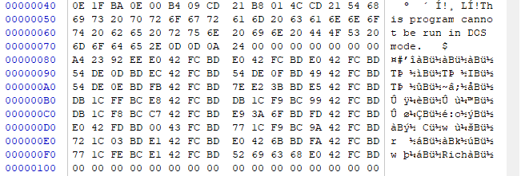
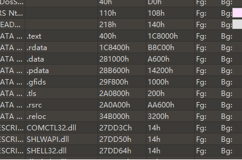
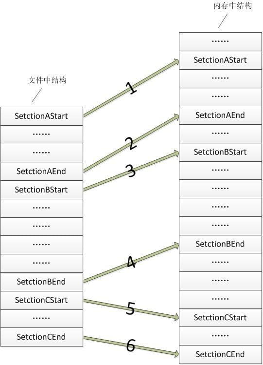
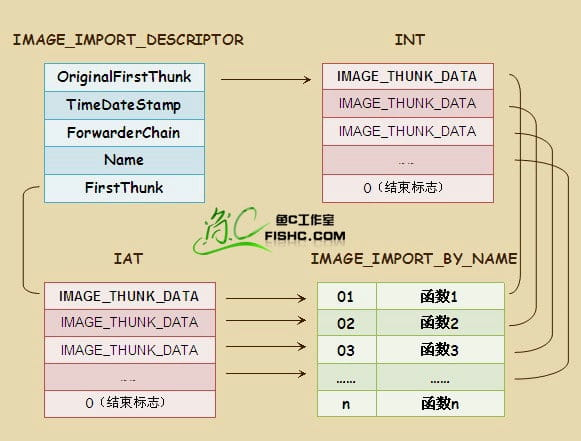
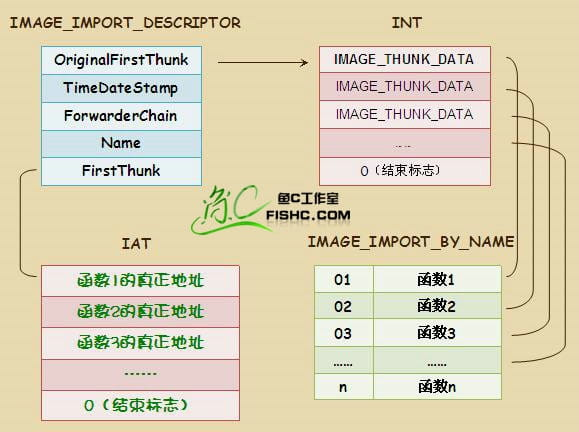
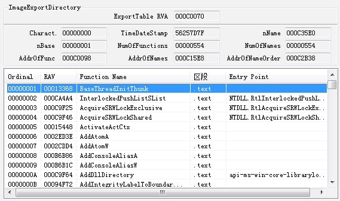

# PE

---

PE 与 ELF 文件基本相同，也是采用了基于段的格式，同时 PE 也允许程序员将变量或者函数放在自定义的段中， GCC 中 attribute(section('name')) 扩展属性。

PE 文件的前身是 COFF，所以分析 PE 文件，先来看看 COFF 的文件格式，他保存在 WinNT.h 文件中。

COFF 的文件格式和 ELF 几乎一样

| Image Header                        |
|-------------------------------------|
| SectionTable Image\_SECTION\_HEADER |
| \.text                              |
| \.data                              |
| \.drectve                           |
| \.debug$S                           |
| \.\.\. other sections               |
| Symbol Table                        |

文件头定义在 WinNT.h 中，我们打开来看一下：
- https://docs.microsoft.com/en-us/windows/win32/api/winnt/ns-winnt-image_file_header
```h
typedef struct _IMAGE_FILE_HEADER {
  WORD Machine;
  WORD NumberOfSections;
  DWORD TimeDateStamp;
  DWORD PointerToSymbolTable;
  DWORD NumberOfSymbols;
  WORD SizeOfOptionalHeader;
  WORD Characteristics;
} IMAGE_FILE_HEADER,*PIMAGE_FILE_HEADER;
```

我们可以看到，它这个文件头和 ELF 实际上是一样的，也在文件头中定义了段数，符号表的位置，Optional Header 的大小，这个Optional Header 后边就看到了，他就是 PE 可执行文件的文件头的部分，以及段的属性等。

跟在文件头后边的是 COFF 文件的段表，结构体名叫 IMAGE_SECTION_HEADER ：
- https://docs.microsoft.com/en-us/windows/win32/api/winnt/ns-winnt-image_section_header

```h
typedef struct _IMAGE_SECTION_HEADER {
  BYTE  Name[IMAGE_SIZEOF_SHORT_NAME];
  union {
    DWORD PhysicalAddress;
    DWORD VirtualSize;
  } Misc;
  DWORD VirtualAddress;
  DWORD SizeOfRawData;
  DWORD PointerToRawData;
  DWORD PointerToRelocations;
  DWORD PointerToLinenumbers;
  WORD  NumberOfRelocations;
  WORD  NumberOfLinenumbers;
  DWORD Characteristics;
} IMAGE_SECTION_HEADER, *PIMAGE_SECTION_HEADER;
```

属性包括这些，和ELF 没差：
- 段名
- 物理地址 PhysicalAddress
- 虚拟地址 VirtualAddress
- 原始数据大小 Sizeof raw data
- 段在文件中的位置 File pointer to raw data
- 该段的重定位表在文件中的位置 File pointer to relocation table
- 该段的行号表在文件中的位置 File pointer to line number
- 标志位，包括段的类型，对齐方式，读取权限等标志。

---

# DOS 头

在我们分析 PE 的之前，还有另外一个头要了解一下，DOS 头，不得不说，微软事儿还是挺多的。

微软在创建 PE 文件格式时，人们正在广泛使用 DOS 文件，所以微软为了考虑兼容性的问题，所以在 PE 头的最前边还添加了一个  IMAGE_DOS_HEADER 结构体，用来扩展已有的 DOS EXE。在 WinNTFS.h 里可以看到他的身影。
```h
typedef struct _IMAGE_DOS_HEADER {  // DOS .EXE header
    WORD e_magic;                   // Magic number
    WORD e_cblp;                    // Bytes on last page of file
    WORD e_cp;                      // Pages in file
    WORD e_crlc;                    // Relocations
    WORD e_cparhdr;                 // Size of header in paragraphs
    WORD e_minalloc;                // Minimum extra paragraphs needed
    WORD e_maxalloc;                // Maximum extra paragraphs needed
    WORD e_ss;                      // Initial (relative) SS value
    WORD e_sp;                      // Initial SP value
    WORD e_csum;                    // Checksum
    WORD e_ip;                      // Initial IP value
    WORD e_cs;                      // Initial (relative) CS value
    WORD e_lfarlc;                  // File address of relocation table
    WORD e_ovno;                    // Overlay number
    WORD e_res[4];                  // Reserved words
    WORD e_oemid;                   // OEM identifier (for e_oeminfo)
    WORD e_oeminfo;                 // OEM information; e_oemid specific
    WORD e_res2[10];                // Reserved words
    LONG e_lfanew;                  // File address of new exe header
    } IMAGE_DOS_HEADER, *PIMAGE_DOS_HEADER;
```

DOS 头结构体的大小是 40 字节，这里边有两个重要的成员，需要知道，一个是 e_magic 魔数，一个是 e_lfanew，它只是了 NT 头的偏移。

对于 PE 文件来说，这个 e_magic，也就是 DOS 签名都是 MZ，据说是一个叫 Mark Zbikowski 的开发人员在微软设计了这种 ODS 可执行文件，所以...

我们以 Windows 下的 notepad++ 的可执行文件为例，在二进制编辑软件中打开，此类软件比较多，WinHex 打开：


开始的两个字节是 4D5A，e_lfanew 为 00000110 注意存储顺序，小端。

你以为开头加上了 DOS 头就完事了么，就可以跟着接 PE 头了么。为了兼容 DOS 当然不是这么简单了，紧接着 DOS 头，跟的是 DOS 存根，DOS stub。这一块就是为 DOS 而准备的，对于 PE 文件，即使没有它也可以正常运行。



旁边的 ASCII 是读不懂的，因为他是机器码，是汇编，为了在 DOS 下执行，对于 notepad++ 来说，这里是执行了一句，this program cannot be run in DOS mode 然后退出。

---

# NT头

下面进入正题，在二进制编辑软件上也看到了 PE，这一块就是正式的步入 PE 的范畴。

- https://docs.microsoft.com/en-us/windows/win32/api/winnt/ns-winnt-image_nt_headers32
- https://docs.microsoft.com/en-us/windows/win32/api/winnt/ns-winnt-image_nt_headers64

```h
typedef struct _IMAGE_NT_HEADERS {
  DWORD                   Signature;
  IMAGE_FILE_HEADER       FileHeader;
  IMAGE_OPTIONAL_HEADER32 OptionalHeader;
} IMAGE_NT_HEADERS32, *PIMAGE_NT_HEADERS32;
```

这是 32 位的 PE 文件头定义。第一个成员就是签名，如我们所说，就是我们看到的「PE」，对应为 50450000h。

这里边有两个东西，第一个就是我们之前看到的 COFF 文件头，这里直接放进来了，我们不再分析。

看第二个，IMAGE_OPTIONAL_HEADER 不是说这个头可选，而是里边有些变量是可选的，而且有一些变量是必须的，否则会导致文件无法运行：
- https://docs.microsoft.com/en-us/windows/win32/api/winnt/ns-winnt-image_optional_header32
- https://docs.microsoft.com/en-us/windows/win32/api/winnt/ns-winnt-image_optional_header64

```h
typedef struct _IMAGE_OPTIONAL_HEADER {
  WORD                 Magic;
  BYTE                 MajorLinkerVersion;
  BYTE                 MinorLinkerVersion;
  DWORD                SizeOfCode;
  DWORD                SizeOfInitializedData;
  DWORD                SizeOfUninitializedData;
  DWORD                AddressOfEntryPoint;
  DWORD                BaseOfCode;
  DWORD                BaseOfData;
  DWORD                ImageBase;
  DWORD                SectionAlignment;
  DWORD                FileAlignment;
  WORD                 MajorOperatingSystemVersion;
  WORD                 MinorOperatingSystemVersion;
  WORD                 MajorImageVersion;
  WORD                 MinorImageVersion;
  WORD                 MajorSubsystemVersion;
  WORD                 MinorSubsystemVersion;
  DWORD                Win32VersionValue;
  DWORD                SizeOfImage;
  DWORD                SizeOfHeaders;
  DWORD                CheckSum;
  WORD                 Subsystem;
  WORD                 DllCharacteristics;
  DWORD                SizeOfStackReserve;
  DWORD                SizeOfStackCommit;
  DWORD                SizeOfHeapReserve;
  DWORD                SizeOfHeapCommit;
  DWORD                LoaderFlags;
  DWORD                NumberOfRvaAndSizes;
  IMAGE_DATA_DIRECTORY DataDirectory[IMAGE_NUMBEROF_DIRECTORY_ENTRIES];
} IMAGE_OPTIONAL_HEADER32, *PIMAGE_OPTIONAL_HEADER32;
```

有这么几个需要重点关注的成员，这些都是文件运行所必需的：
- Magic 魔数，对于 32 结构体来说是 10B，对于 64 结构体来说是 20B.
- AddressOfEntryPoint 持有 EP 的 RVA 值，之处程序最先执行的代码起始位置，也就是程序入口。
- ImageBase 进程虚拟内存的范围是 0-FFFFFFFF (32位)。PE 文件被加载到这样的内存中，ImageBase 指出文件的优先装入位置。
- SectionAlignment, FileAlignment PE 文件的 Body 部分划分为若干段，FileAlignment 之处段在磁盘文件中的最小单位，SectionAlignment指定了段在内存中的最小单位。
- SizeOfImage 指定 PE Image 在虚拟内存中所占的空间大小。
- SizeOfHeader PE 头的大小。
- Subsystem 用来区分系统驱动文件与普通可执行文件。
- NumberOfRvaAndSizes 指定 DataDirectory 数组的个数,虽然最后一个值，指出个数是 16，但实际上 PE 装载还是通过识别这个值来确定大小的。至于 DataDirectory 是什么看下边
- DataDirectory 它是一个由 IMAGE_DATA_DIRECTORY 结构体组成的数组，数组每一项都有定义的值，里边有一些重要的值，EXPORT/IMPORT/RESOURCE, TLS direction 是重点关注的。

---

# 段头

PE 的段头直接沿用的 COFF 的段头结构，上边也说过了，我们查看 notepad++ 的段头，可以获得各个段名，以及其信息，这里，我们可以使用一些软件查看，更加方便,这里使用 010 Editor：



---

# RVA to RAW

理解 PE 最重要的一个部分就是理解文件从磁盘到内存地址的映射过程，做逆向的人员，只有熟练地掌握才能跟踪到程序的调用过程和位置，才能分析和寻找漏洞。

对于文件和内存的映射关系，其实很简单，他们通过一个简单的公式计算而来：



换算公式是这样的：

RAW -PointToRawData = RVA - VirtualAddress

寻找过程就是先找到 RVA 所在的段，然后根据公式计算出文件偏移。因为我们通过逆向工具，可以在内存中查找到所在的 RVA，进而我们就可以计算出在文件中所在的位置，这样，就可以手动进行修改。

一些软件查看载入的段头，其中的 V Addr, 实际上就是 VirtualAddress，R offset 就是 PointerToRawData。


假如我们的 RVA 地址是 5000，那么计算方法就是，查看区段，发现在 .text 中，5000-1000+400 = 4400，这就是 RAW 00004400，而实际上，因为我们的 ImageBase 是 00400000，所以，我们在反编译时候内存中的地址是 00405000.

接下来，使我们的 PE 头中的核心内容，IAT 和 EAT，也就是 Import address table, export address table.

---

# IAT

导入地址表的内容与 Windows 操作系统的核心进程，内存，DLL 结构有关。他是一种表格，记录了程序使用哪些库中的哪些函数。

下面，让我们把目光转到 DLL 上，Dynamic Linked Library 支撑了整个 OS。DLL 的好处在于，不需要把库包含在程序中，单独组成 DLL 文件，需要时调用即可，内存映射技术使加载后的 DLL 代码，资源在多个进程中实现共享，更新库时候只要替换相关 DLL 文件即可。

加载 DLL 的方式有两种，一种是显式链接，使用 DLL 时候加载，使用完释放内存。另一种是隐式链接，程序开始就一同加载 DLL，程序终止的时候才释放掉内存。而 IAT 提供的机制与隐式链接相关，最典型的 Kernel32.dll。

我们来看看 notepad++ 调用 kernel32.dll 中的 CreateFileW


我们看到填入参数之后，call 了 35d7ffff 地址的内容，然后我们去 dump 窗口，找一下 kernel.CreateFileW：


我们双击汇编窗口，启动编辑，发现确实是 call 的这个数值：


可是问题来了，上边是 E8 35D7FFFF，下边地址却是 00C62178。其实这是 Windows 的 ASLR 技术，主要就是针对缓冲溢出攻击的一种保护技术，通过随机化布局，让逆向跟踪者，难以查找地址，就难以简单的进行溢出攻击。不过还是可以通过跳板的方式，找到溢出的办法，这就是后话了。

现在可以确定的是，35D7FFFF 可以认为保存的数值就是 CreateFileW 的地址。而为什么不直接使用 CALL 7509168B 这种方式直接调用呢？ Kernel32.dll 版本各不相同，对应的 CreateFileW 函数也各不相同，为了兼容各种环境，编译器准备了 CreateFileW 函数的实际地址，然后记下 DWORD PTR DS：[xxxxxx] 这样的指令，执行文件时候，PE 装载器将 CreateFileW 函数地址写到这个位置。

同时，由于重定位的原因存在，所以也不能直接使用 CALL 7509168B 的方式，比如两个 DLL 文件有相同的 ImageBase，装载的时候，一个装载到该位置之后，另一个就不能装载该位置了，需要换位置。所以我们不能对实际地址进行硬编码。

IMAGE_IMPORT_DESCRIPTOR
```h
IMAGE_IMPORT_DESCRIPTOR

typedef struct _IMAGE_IMPORT_DESCRIPTOR {
union {
DWORD Characteristics;
DWORD OriginalFirstThunk;//指向输入名称表的表（INT）的RVA
};
DWORD TimeDateStamp;
DWORD ForwarderChain;
DWORD Name;//指向导入映像文件的名称
DWORD FirstThunk;//指向输入地址表的表（IAT）的RVA

} IMAGE_IMPORT_DESCRIPTOR;

typedef struct _IMAGE_THUNK_DATA32 {
    union {
        PBYTE  ForwarderString;                                   //指向一个转向者字符串的RVA；
        PDWORD Function;      //被输入的函数的内存地址；
        DWORD Ordinal;       //被输入的API的序数值
        PIMAGE_IMPORT_BY_NAME  AddressOfData;      //指向IMAGE_IMPORT_BY_NAME
    } u1;
} IMAGE_THUNK_DATA32;

typedef struct _IMAGE_IMPORT_BY_NAME {
WORD Hint;//ordinal
BYTE Name[1];//function name string
} IMAGE_IMPORT_BY_NAME, *PIMAGE_IMPORT_BY_NAME;
```

对于一个普通程序来说，需要导入多少个库，就会存在多少个这样的结构体，这些结构体组成数组，然后数组最后是以NULL 结构体结束。其中有几个重要的成员：
- OriginalFirstThunk INT Import Name Table 地址，RVA
- Name 库名称字符串地址，RVA，就是说该地址保存库名称
- First Thunk IAT 地址 RVA
- INT 中个元素的值是上边那个IMAGE_IMPORT_BY_NAME 结构体指针。
- INT 与 IAT 大小应相同。

那么 PE 是如何导入函数输出到 IAT 的：
1. 读取 NAME 成员，获取扩名称字符串
2. 装载相应库： LoadLibrary("kernel32.dll")
3. 读取 OriginalFirstThunk 成员，获取 INT 地址
4. 读取 INT 数组中的值，获取相应的 IMAGE_IMPORT_BY_NAME地址，是 RVA 地址
5. 使用 IMAGE_IMPORT_BY_NAME 的 Hint 或者是 name 项，获取相应函数的起始位置 GetProcAddress("GetCurrentThreadId")
6. 读取 FistrThunk 成员，获得 IAT 地址。
7. 将上面获得的函数地址输入相应 IAT 数组值。
8. 重复 4-7 到 INT 结束。

这里就产生了一个疑惑，OriginalFirstThunk 和 First Thunk 都指向的是函数，为什么多此一举呢？

首先，从直观上说，两个都指向了库中引入函数的数组，鱼C 画的这张图挺直观：



OriginalFirstThunk 和 FirstThunk 他们都是两个类型为 IMAGE_THUNK_DATA 的数组，它是一个指针大小的联合（union）类型。

每一个 IMAGE_THUNK_DATA 结构定义一个导入函数信息（即指向结构为 IMAGE_IMPORT_BY_NAME 的家伙，这家伙稍后再议）。

然后数组最后以一个内容为 0 的 IMAGE_THUNK_DATA 结构作为结束标志。

IMAGE_THUNK_DATA32 结构体如下：
```h
typedef struct _IMAGE_THUNK_DATA32 {
     union {
           DWORD ForwarderString;          // 一个RVA地址，指向forwarder string
           DWORD Function;                       // PDWORD，被导入的函数的入口地址
           DWORD Ordinal;                         // 该函数的序数
           DWORD AddressOfData;           // 一个RVA地址，指向IMAGE_IMPORT_BY_NAME
      } u1;
} IMAGE_THUNK_DATA32;
```

因为是Union 结构，IMAGE_THUNK_DATA 事实上是一个双字大小。
规定如下：

当 IMAGE_THUNK_DATA 值的最高位为 1时，表示函数以序号方式输入，这时候低 31 位被看作一个函数序号。

当 IMAGE_THUNK_DATA 值的最高位为 0时，表示函数以字符串类型的函数名方式输入，这时双字的值是一个 RVA，指向一个 IMAGE_IMPORT_BY_NAME 结构。

我们再看 IMAGE_IMPORT_BY_NAME 结构：
```h
typedef struct _IMAGE_IMPORT_BY_NAME {
     WORD Hint;            // 该函数的导出序数
     BYTE Name[1];      // 该函数的名字
} IMAGE_IMPORT_BY_NAME, *PIMAGE_IMPORT_BY_NAME;
```
结构中的 Hint 字段也表示函数的序号，不过这个字段是可选的，有些编译器总是将它设置为 0。

Name 字段定义了导入函数的名称字符串，这是一个以 0 为结尾的字符串。

第一个数组（由 OriginalFirstThunk 所指向）是单独的一项，而且不能被改写，我们前边称为 INT。第二个数组（由 FirstThunk 所指向）事实上是由 PE 装载器重写的。

PE 装载器装载顺序正如上边所讲的那样，我们再将它讲详细一点：

PE 装载器首先搜索 OriginalFirstThunk ，找到之后加载程序迭代搜索数组中的每个指针，找到每个 IMAGE_IMPORT_BY_NAME 结构所指向的输入函数的地址，然后加载器用函数真正入口地址来替代由 FirstThunk 数组中的一个入口，因此我们称为输入地址表(IAT).



所以，在读取一次 OriginalFirstThunk 之后，程序就是依靠 IAT 提供的函数地址来运行了。

---

# EAT

搞清楚了 IAT 的原理，EAT 就好理解了，长话短说。IAT 是导入的库和函数的表，那么 EAT 就对应于导出，它使不同的应用程序可以调用库文件中提供的函数，为了方便导出函数，就需要保存这些导出信息。

回头看 PE 文件中的 PE 头我们可以看到 IMAGE_EXPORT_DIRECTORY 结构体以的位置，他在 IMAGE_OPTIONAL_HEADER32.DataDirectory[0].VirtualAddress 的值就是 IMAGE_EXPORT_DIREDCTORY 的起始位置。


IMAGE_EXPORT_DIRECTORY 结构体如下：
```h
typedef struct _IMAGE_EXPORT_DIRECTORY {
	DWORD Characteristics;			//保留 总是定义为0
	DWORD TimeDateStamp;			//文件生成时间
	WORD  MajorVersion;				//主版本号 一般不赋值
	WORD  MinorVersion;				//次版本号 一般不赋值
	DWORD Name;						//模块的真实名称
	DWORD Base;						//索引基数 加上序数就是函数地址数组的索引值
	DWORD NumberOfFunctions;		//地址表中个数
	DWORD NumberOfNames;			//名称表的个数
	DWORD AddressOfFunctions;		//输出函数地址的 RVA
	DWORD AddressOfNames;			//输出函数名字的 RVA
	DWORD AddressOfNameOrdinals;	//输出函数序号的 RVA
} IMAGE_EXPORT_DIRECTORYM, *pIMAGE_EXPORT_DIRECTORY;
```

这里边同样是这么几个重要的成员：
- NumberOfFunctions 实际Export 函数的个数
- NumberOfNames Export 函数中具名的函数个数
- AddressOfFunctins Export 函数地址数组，数组个数是上边的NOF
- AddressOfNames 函数名称地址数组，个数是上边的NON
- AddressOfNameOrdinals Ordinal 地址数组，个数等于上边NON
- Name 一个RVA 值，指向一个定义了模块名称的字符串。如即使Kernel32.dll 文件被改名为”Ker.dll”。仍然可以从这个字符串中的值得知其在编译时的文件名是”Kernel32.dll”。
- Base：导出函数序号的起始值，将AddressOfFunctions 字段指向的入口地址表的索引号加上这个起始值就是对应函数的导出 序号。
    以kernel32.dll 为例，我们看一下：

    

从上边这些成员，我们实际上可以看出，是有两种方式提供给那些想调用该库中函数的，一种是直接从序号查找函数入口地址导入，一种是通过函数名来查找函数入口地址导入。


上边图，注意一点，因为 AddressOfNameOrdinals 的序号应当是从 0 开始的，不过图中映射的是第二个函数指向的序号 1。

**当已知导出序号的时候**

1. Windows 装载器定位到PE 文件头，
2. 从PE 文件头中的 IMAGE_OPTIONAL_HEADER32 结构中取出数据目录表，并从第一个数据目录中得到导出表的RVA ，
3. 从导出表的 Base 字段得到起始序号，
4. 将需要查找的导出序号减去起始序号，得到函数在入口地址表中的索引，
5. 检测索引值是否大于导出表的 NumberOfFunctions 字段的值，如果大于后者的话，说明输入的序号是无效的用这个索引值在 AddressOfFunctions 字段指向的导出函数入口地址表中取出相应的项目，这就是函数入口地址的RVA 值，当函数被装入内存的时候，这个RVA 值加上模块实际装入的基地址，就得到了函数真正的入口地址

**当已知函数名称查找入口地址时**

1. 从导出表的 NumberOfNames 字段得到已命名函数的总数，并以这个数字作为循环的次数来构造一个循环
2. 从 AddressOfNames 字段指向得到的函数名称地址表的第一项开始，在循环中将每一项定义的函数名与要查找的函数名相比较，如果没有任何一个函数名是符合的，表示文件中没有指定名称的函数，如果某一项定义的函数名与要查找的函数名符合，那么记下这个函数名在字符串地址表中的索引值，然后在 AddressOfNamesOrdinals 指向的数组中以同样的索引值取出数组项的值，我们这里假设这个值是x
3. 最后，以 x 值作为索引值，在 AddressOfFunctions 字段指向的函数入口地址表中获取的 RVA 就是函数的入口地址

一般来说，做逆向或者是写代码都是第二种方法，我们以 kernel32.dll 中的 GetProcAddress 函数为例，其操作原理如下：
1. 利用 AddressOfNames 成员转到 『函数名称数组』
2. 『函数名称数组』中存储着字符串地址，通过比较字符串，查找指定的函数名称，此时数组所以为成为name_index
3. 利用 AddressOfNameOrdinals 成员，转到这个序号数组
4. 在ordinal 数组中通过name_index 查找到相应的序号
5. 利用AddressOfFunctions 成员，转到『函数地址数组』EAT
6. 在EAT 中将刚刚得到的ordinal 作为索引，获得指定函数的入口地址

---

**Source & Reference**
- [ELF&PE 文件结构分析](https://www.jianshu.com/p/af9766222816)
