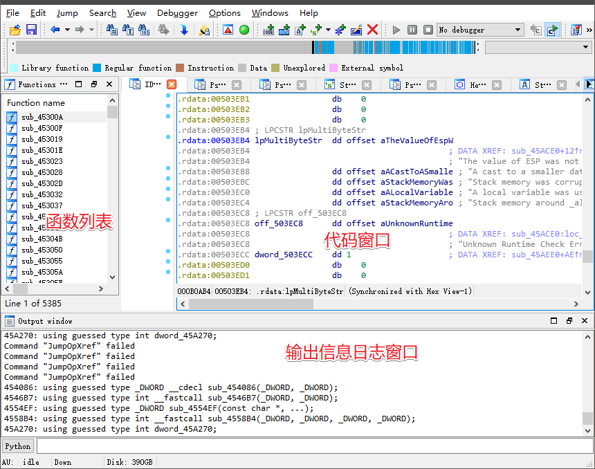
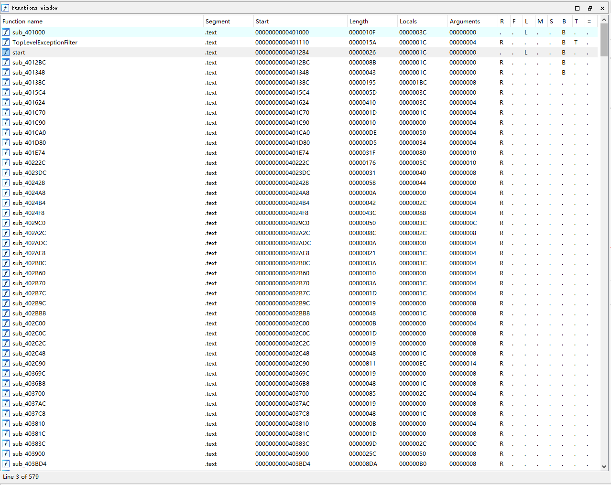
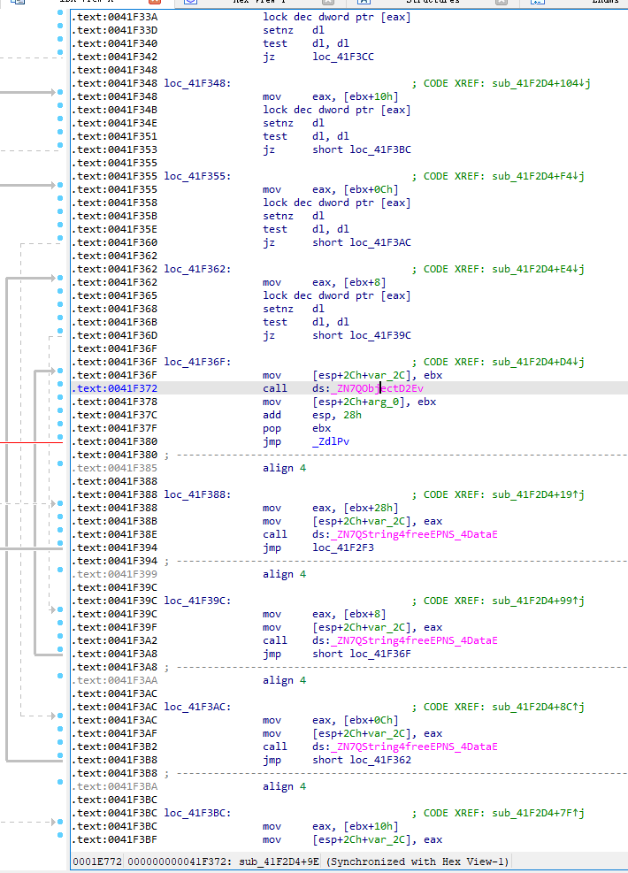
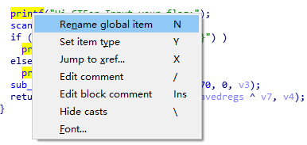
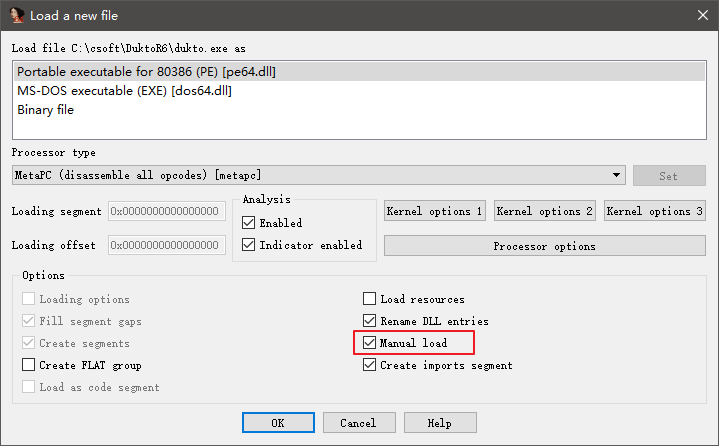
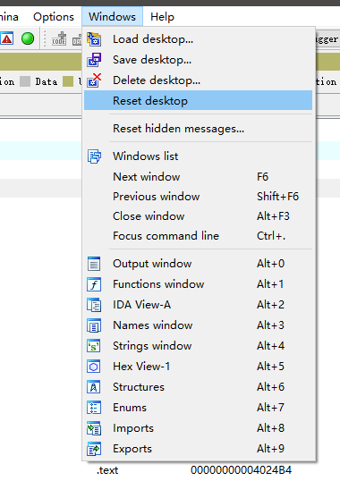

# IDA

---

**相关文章**
- [萌新学逆向——T1 IDA的正确开启姿势](https://mp.weixin.qq.com/s/I9vJp8fp7RcCls0tz8Dvlg)
- [分析实战读书笔记3_IDA小知识](https://mp.weixin.qq.com/s/Cktu1sK0PILbO0-QJb9Y6A)

**相关扩展**
- [lcq2/riscv-ida](https://github.com/lcq2/riscv-ida) - risc-v 插件

---

**目录结构**

IDA 主程序有2个: ida.exe 和 ida64.exe
- ida.exe 用于分析 32 位应用程序
- ida64.exe 用于分析 64 位应用程序

如果无法判断目标程序是 32 位还是 64 位的，可以直接打开, 会有相应提示。

ida64可以反汇编32位应用程序，但是无法生成32位应用程序的伪代码。

# 界面组成

左侧的窗口是函数列表，包含了该程序中的所有函数，这里的函数名几乎都是以 sub_XXXX...  开头，这是因为源程序编译之后，函数的符号名属于无用数据，被删除掉了，函数代码所在的内存地址就成为了唯一标识一个函数的数据。对于无符号名的函数，IDA 采用 sub_ + 函数所在的内存地址对函数进行命名。这个窗口可以拉大一些,后面还有开始地址，结束地址，长度、类型等。

右侧是代码窗口，目前正在显示的是汇编代码。

底侧是输出信息日志的窗口，错误信息从该窗口获取。

代码窗口中，左边 .radata 代表内存地址，aHiCtferxxxx 是 IDA 为该地址对应数据生成的一个标识符 (别名)，行末是该内存对应的数据

这里的标识符是 IDA 为方便阅读，按照一定规则自动生成的，实际程序运行时，直接使用实际内存地址引用数据，但内存地址不便于记忆，所以 IDA 按可读性进行了生成。

**名字窗口 (Shift+F4)**

名字窗口展示了 IDA 解析出来的函数名称，字符串名称，变量名称等一些名称字符串。

**字符串窗口 (Shift+F12)**

字符串窗口显示了 IDA 解析出来的字符串，但是仅支持 ASCII 码字符串展示。

**图形窗口跳转箭头**

- 红色箭头表示跳转未执行；
- 绿色箭头表示跳转执行了；
- 蓝色箭头表示无条件跳转。

**文本窗口跳转箭头**

- 虚线箭头表示条件跳转
- 实线箭头表示无条件跳转
- 向上的箭头一般代表循环。

---

# 基本操作

- shift + F12 打开 Strings 页面，用于查看程序中所有字符串，在其中 Ctrl + F 查找关键字符串
- \[查找交叉引用] 选中标识符，按 X 找出程序中所有引用该字符串的代码

    
- 转换伪代码,在引用代码处按 Tab 或 F5
- 伪代码函数改名，选择函数右键，rename

    

**加载前指定基地址**

将样本拖入 IDA 后勾选 Manual load，然后点击 OK，输入基地址，这样可以在 IDA 进行加载时就执行基址重定向相关工作。同时，这种操作还有另一个好处，可以让 IDA 显示 PE 头部数据。

**显示硬编码**

点击顶部菜单栏 Options->Genaral，将 Number of opcode.... 设置为 10，就可以看到硬编码了。

**重置视图排版**

当你乱拖动窗口发现弄不回去了的时候，点击 Reset desktop 可以将各个窗口位置重置，同样的，点击 Save desktop 也可以保存你设置好的窗口布局。

**文件偏移跳转**

IDA 中的地址是内存中拉伸后的地址，当你在 HEX 查看器里发现一些有趣的数据时，可以通过 Jump to file offset 直接输入文件偏移进行跳转，省去了我们手动进行地址转换的时间。

**搜索**

- Alt+T 搜索字符串，可以搜索指令的字符串 如 fs：
- Alt+B 搜索字节数据，如 30 00 00 00。

**识别函数**

当 IDA 无法正确识别一段函数时，可以按 P 手动要求 IDA 识别函数。

Alt+P 可以指定函数的细节，如开始位置，结束位置，是否为 EBP 寻址，参数变量默认长度等。
